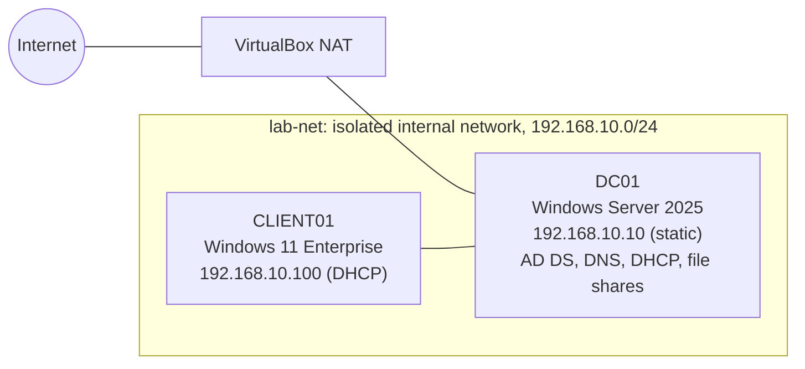

# Active Directory Help Desk Lab

A Windows Server 2025 and Windows 11 home lab where I built a small company network from scratch, then used it to work real help desk tickets: account lockouts, password resets, a missing network drive, a broken domain trust, a DHCP outage, and employee offboarding. Every step is documented with screenshots, including the mistakes and how I fixed them.

## At a Glance

| | |
|---|---|
| **Domain** | `lab.local` |
| **Domain controller** | DC01, Windows Server 2025 (AD DS, DNS, DHCP, file shares) |
| **Workstation** | CLIENT01, Windows 11 Enterprise |
| **Virtualization** | Oracle VirtualBox, two VMs on an isolated internal network |
| **Users** | 11 accounts across HR, Finance, and IT |
| **Scripts** | 2 PowerShell scripts (onboarding and offboarding) |
| **Tickets resolved** | 7 |
| **Screenshots** | 85 |

## Network Diagram



CLIENT01 has no internet access by design. Like a PC on a company network, it gets its address, DNS, and logins from the domain controller.

## What I Built

| Step | What it covers |
|---|---|
| [1. Domain Controller](docs/01-domain-controller.md) | Windows Server 2025 VM, static IP, Active Directory, new `lab.local` forest |
| [2. DNS and DHCP](docs/02-dns-dhcp.md) | DHCP role, AD authorization, address scope, DNS options |
| [3. Users and Groups](docs/03-users-and-groups.md) | OU design, bulk onboarding with PowerShell, department security groups |
| [4. Group Policy and Shares](docs/04-group-policy-and-shares.md) | Password and lockout policy, department file shares, drive mapping by group |
| [5. Client and Domain Join](docs/05-client-and-domain-join.md) | Windows 11 VM, multi-homed DNS fix, domain join, user testing |

## Help Desk Tickets

| # | Ticket | Root cause | Key tools |
|---|---|---|---|
| 1 | [User locked out](scenarios/01-account-lockout.md) | 5 failed sign-ins tripped the lockout policy | `Get-ADUser`, event ID 4740, ADUC |
| 2 | [Windows license expired](scenarios/02-expired-evaluation-license.md) | Evaluation copy never activated online | `slmgr /dlv`, `slmgr /ato` |
| 3 | [Forgotten password](scenarios/03-password-reset.md) | User forgot password after vacation | ADUC password reset |
| 4 | [Domain isn't available](scenarios/04-dhcp-outage.md) | DHCP started before AD and stopped serving | `ipconfig`, DHCP audit log, `sc.exe` |
| 5 | [Mapped drive access denied](scenarios/05-mapped-drive-access-denied.md) | User removed from her department group | `gpresult`, `Get-ADPrincipalGroupMembership` |
| 6 | [Trust relationship failed](scenarios/06-trust-relationship-failed.md) | Computer account password out of sync | `Test-ComputerSecureChannel -Repair` |
| 7 | [Offboard departing employee](scenarios/07-offboarding.md) | Employee leaving the company | `Disable-UserOffboarding.ps1` |

Tickets 2 and 4 weren't planned. They came up while I worked on the lab, and I troubleshot them the same way as the planned tickets.

## Skills Demonstrated

- **Active Directory:** OUs, users, security groups, password resets, account unlocks, computer accounts
- **Group Policy:** domain password and lockout policy, Group Policy Preferences drive maps with item-level targeting
- **Networking:** static IP, DHCP scopes and options, DNS, multi-homed server troubleshooting
- **File services:** SMB shares, NTFS permissions, removing inherited access
- **PowerShell:** bulk user creation from CSV, offboarding automation, AD and network diagnostics
- **Windows 11:** offline setup, domain join, activation, local admin access
- **Troubleshooting tools:** `ipconfig`, `ping`, `nslookup`, `gpresult`, `gpupdate`, `Get-WinEvent`, `icacls`, `slmgr`, `Test-ComputerSecureChannel`

## Lessons Learned

1. **A domain controller with two network cards registers both in DNS.** DC01's internet adapter address showed up in `lab.local` lookups, which can send clients to an address they can't reach. [Fix](docs/05-client-and-domain-join.md#fixing-dns-on-a-multi-homed-domain-controller)
2. **DHCP on a domain controller can start before Active Directory is ready.** It fails its authorization check and quietly stops handing out addresses while still showing "Running." Setting it to delayed start prevents it. [Ticket 4](scenarios/04-dhcp-outage.md)
3. **Validate input before changing anything.** My onboarding script's first run used a password that broke policy and left 10 half-created, disabled accounts behind. [Details](docs/03-users-and-groups.md#first-run-failed)
4. **Cached credentials can hide a broken domain trust.** Users who signed in before still got in; only a first-time user saw the error. [Ticket 6](scenarios/06-trust-relationship-failed.md)
5. **Separate the network from the service.** A temporary static IP that could ping DC01 proved the network worked and the problem was DHCP itself. [Ticket 4](scenarios/04-dhcp-outage.md)
6. **Group membership changes take effect at the next sign-in.** [Ticket 5](scenarios/05-mapped-drive-access-denied.md)

## Scripts

| Script | Purpose |
|---|---|
| [`New-UserOnboarding.ps1`](scripts/New-UserOnboarding.ps1) | Creates users from [`users.csv`](scripts/users.csv), places them in their department OU, adds them to their department group, forces a password change at first sign-in, and logs every action. Prompts for the temporary password instead of storing it. |
| [`Disable-UserOffboarding.ps1`](scripts/Disable-UserOffboarding.ps1) | Records and removes group memberships, disables the account, scrambles the password, stamps the description with date and ticket number, and moves the account to the Terminated OU. |

Sample output from both scripts is in [`scripts/sample-logs`](scripts/sample-logs).

## Repository Structure

```
active-directory-helpdesk-lab/
├── README.md
├── docs/          the build, step by step
├── scenarios/     the 7 help desk tickets
├── scripts/       PowerShell scripts, CSV input, sample logs
└── images/        85 screenshots
```

## Next Improvements

- Onboarding script v2: test the password against the domain policy before creating any accounts
- Turn on "Remove this item when it is no longer applied" for the drive maps, so a drive disappears when a user leaves the group
- Find out why `whoami /groups` on CLIENT01 didn't list domain groups (open question from [Ticket 5](scenarios/05-mapped-drive-access-denied.md))

All names, accounts, and data in this lab are fictional.
