# 1. Building the Domain Controller (DC01)

[← Back to README](../README.md) | [Next: DNS and DHCP →](02-dns-dhcp.md)

DC01 is the heart of the lab: it runs Active Directory, DNS, DHCP, and the department file shares. This page covers building the VM, installing Windows Server 2025, and promoting it to a domain controller for a new `lab.local` forest.

## VM Settings

| Setting | Value |
|---|---|
| OS | Windows Server 2025 Standard Evaluation (Desktop Experience) |
| Memory | 4096 MB |
| CPUs | 2 |
| Disk | 60 GB |
| Adapter 1 | NAT (internet access for updates) |
| Adapter 2 | Internal Network `lab-net` (the lab network) |

I checked **Skip Unattended Installation** so I could control every setup choice myself.

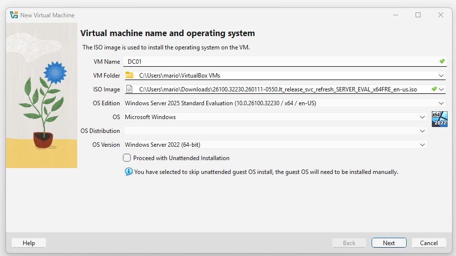

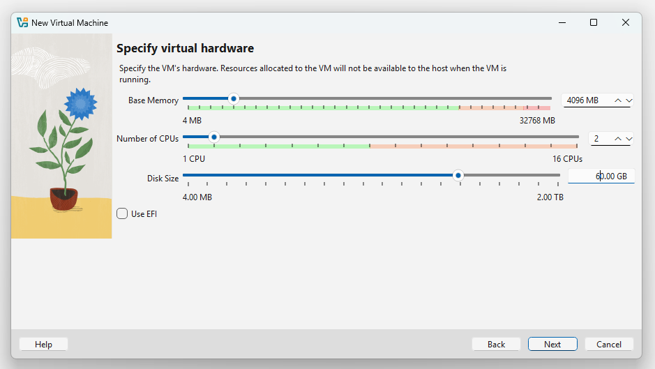

The second adapter connects DC01 to `lab-net`, an isolated network that only the lab VMs share.

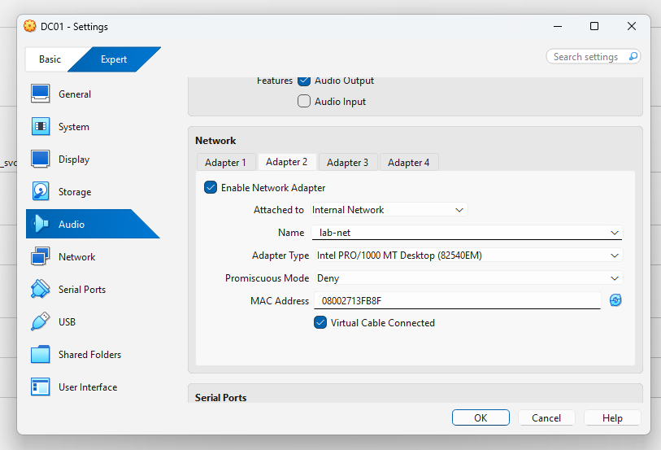

## Installing Windows Server 2025

I chose the **Desktop Experience** edition. The other options install Server Core, which has no graphical interface.

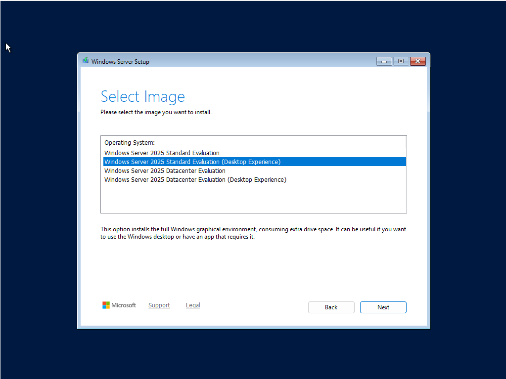

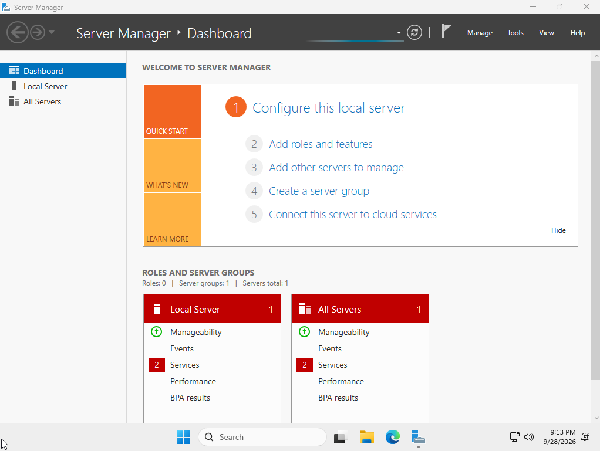

After the first login, I set the time zone to Eastern (Active Directory depends on accurate time) and renamed the server to `DC01`.

## Static IP on the Lab Network

A domain controller needs a fixed address so clients can always find it. I renamed the two adapters so it's clear which is which:

- **Internet-NAT:** gets its address from VirtualBox (internet access)
- **Lab-Internal:** the lab network

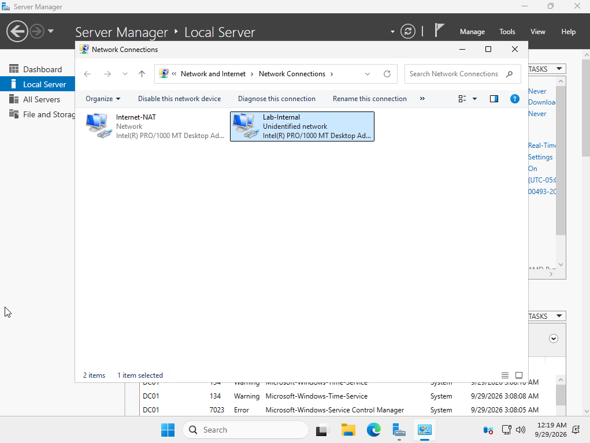

| Setting | Value |
|---|---|
| IP address | 192.168.10.10 |
| Subnet mask | 255.255.255.0 |
| Default gateway | none (isolated network) |
| Preferred DNS | 127.0.0.1 (DC01 answers its own DNS queries) |

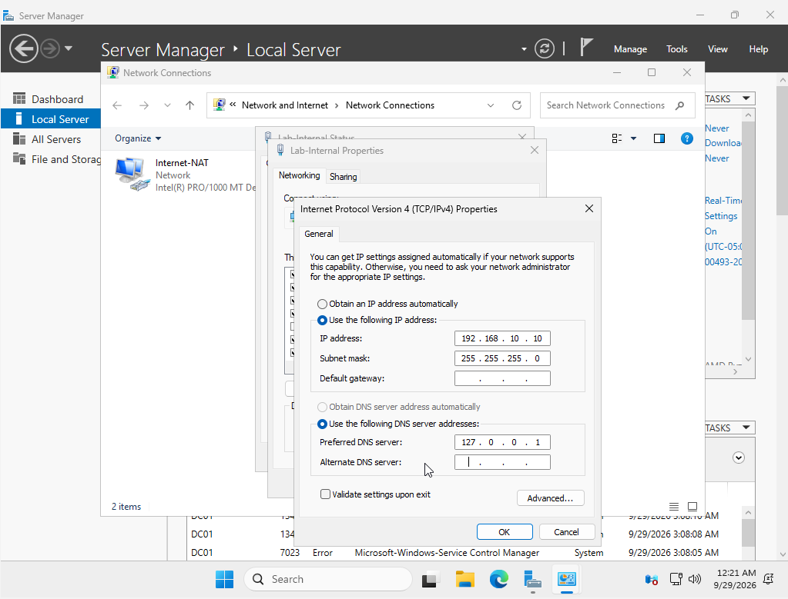

## Installing Active Directory Domain Services

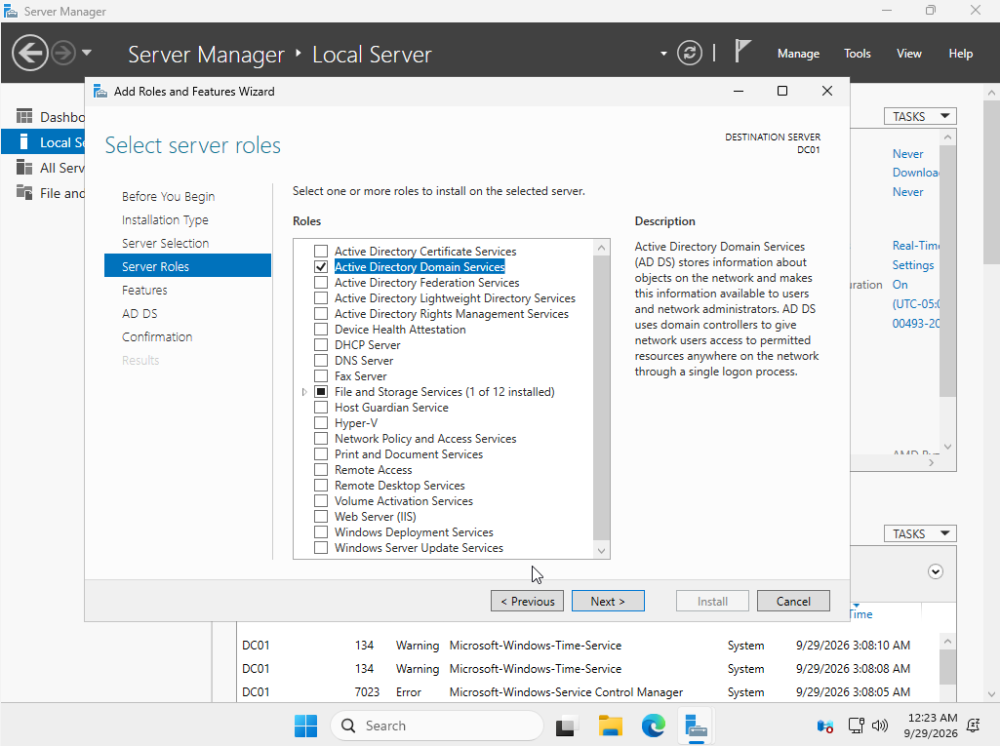

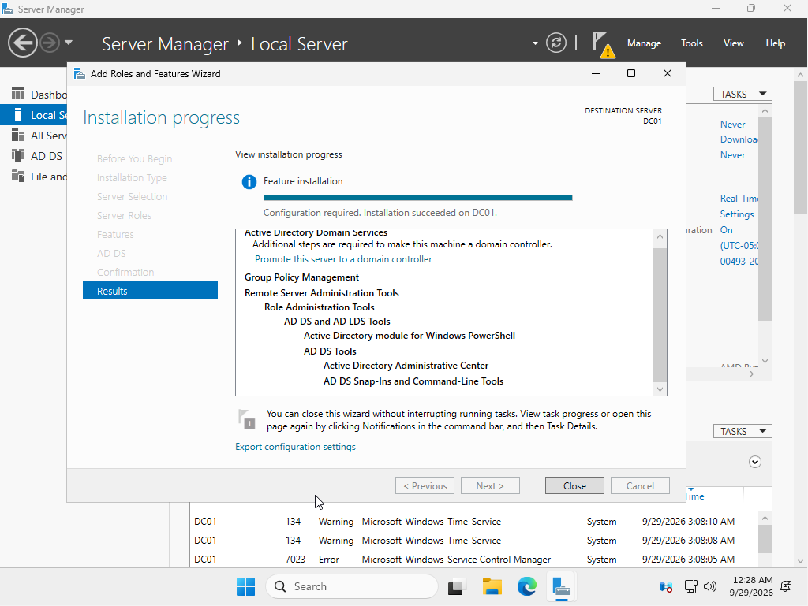

## Promoting DC01 to a Domain Controller

I created a new forest with the root domain `lab.local`. The NetBIOS name is `LAB`, so users sign in as `LAB\username`.

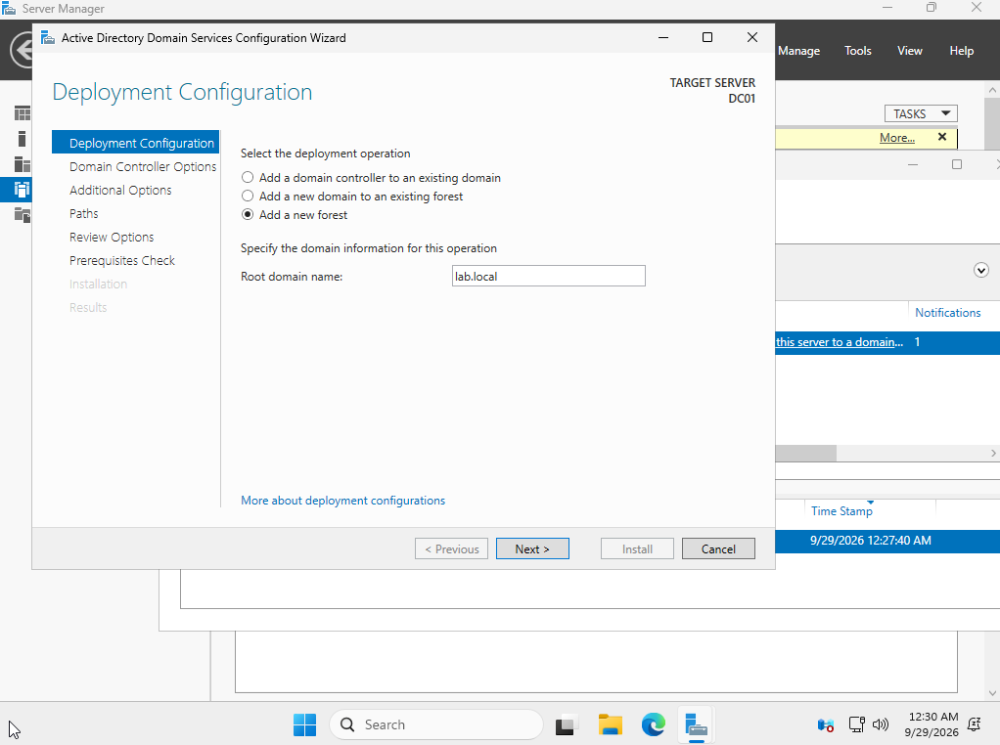

### The Two Prerequisite Warnings

The prerequisites check passed with two warnings. Both are expected in this lab:

1. **"At least one physical network adapter does not have static IP addresses."** The Internet-NAT adapter uses DHCP on purpose so DC01 can reach the internet, and IPv6 isn't set statically. The lab adapter has its static IPv4 address, which is what matters for clients.
2. **"A delegation for this DNS server cannot be created."** `lab.local` has no parent zone on the internet, so there's nothing to delegate from. No action needed.

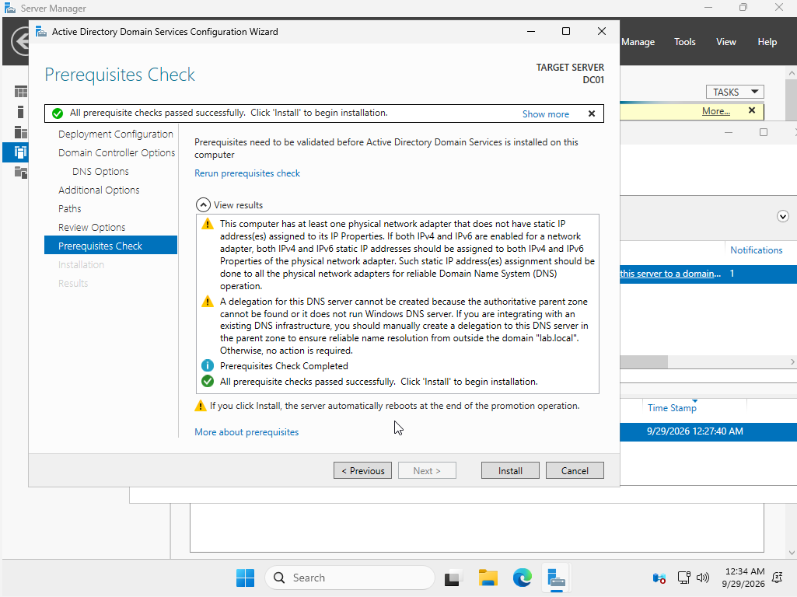

## Result

After the automatic restart, Server Manager showed the AD DS and DNS roles running, and the server joined to `lab.local`.

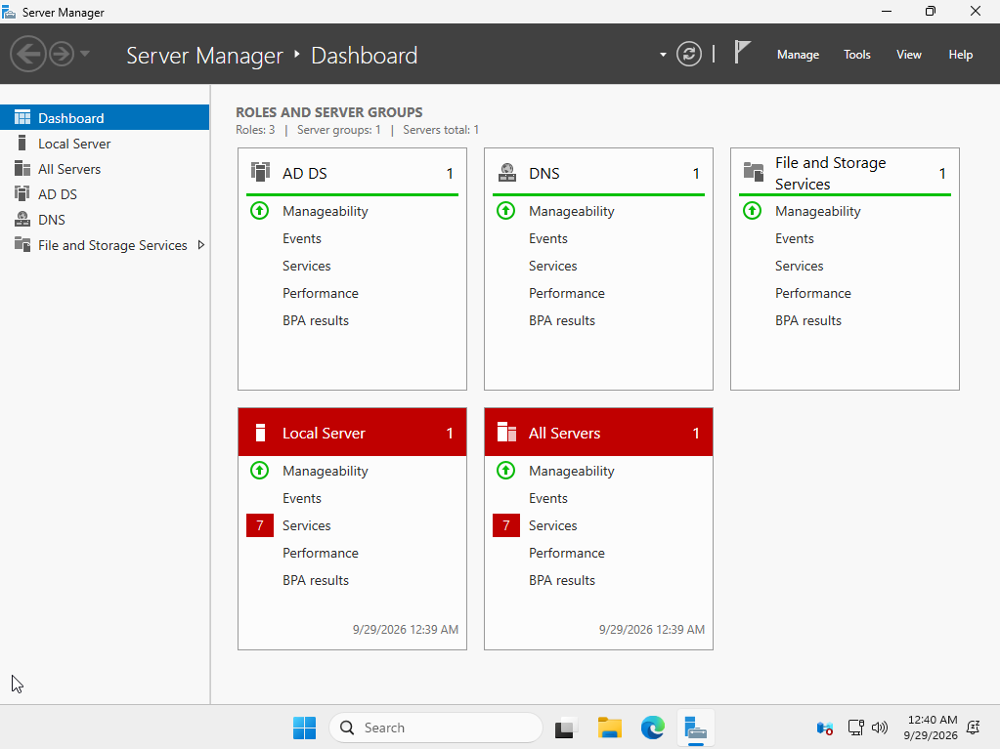

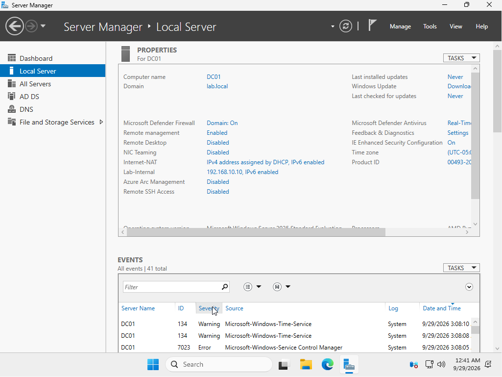

I took a VirtualBox snapshot here, so I could roll back to a clean domain controller at any point.

[Next: DNS and DHCP →](02-dns-dhcp.md)
