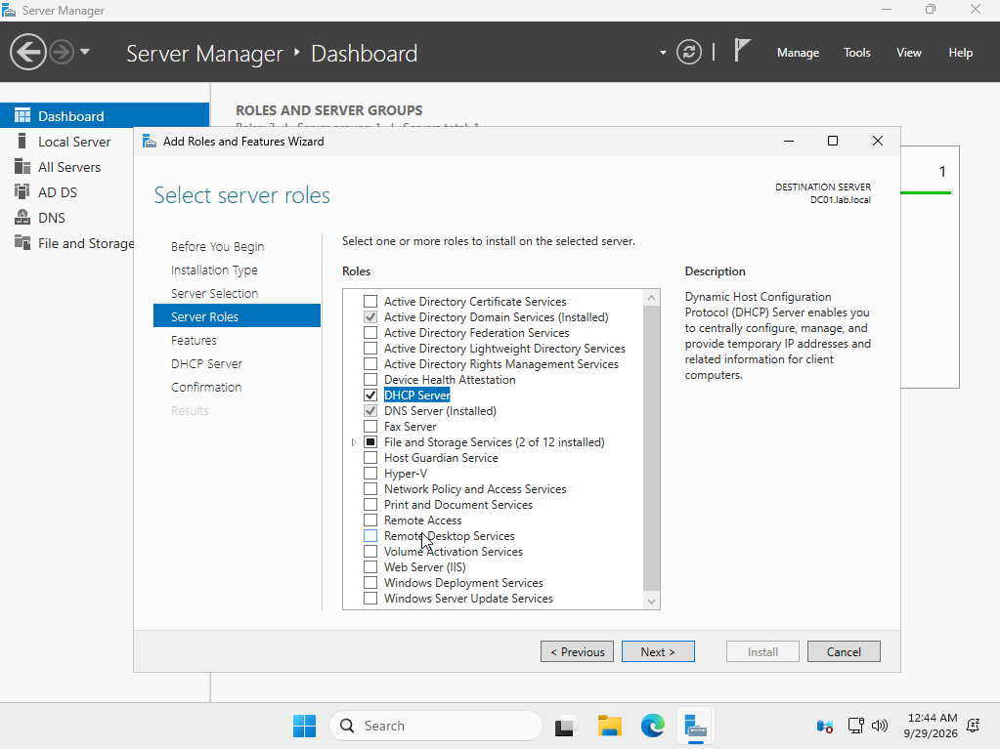
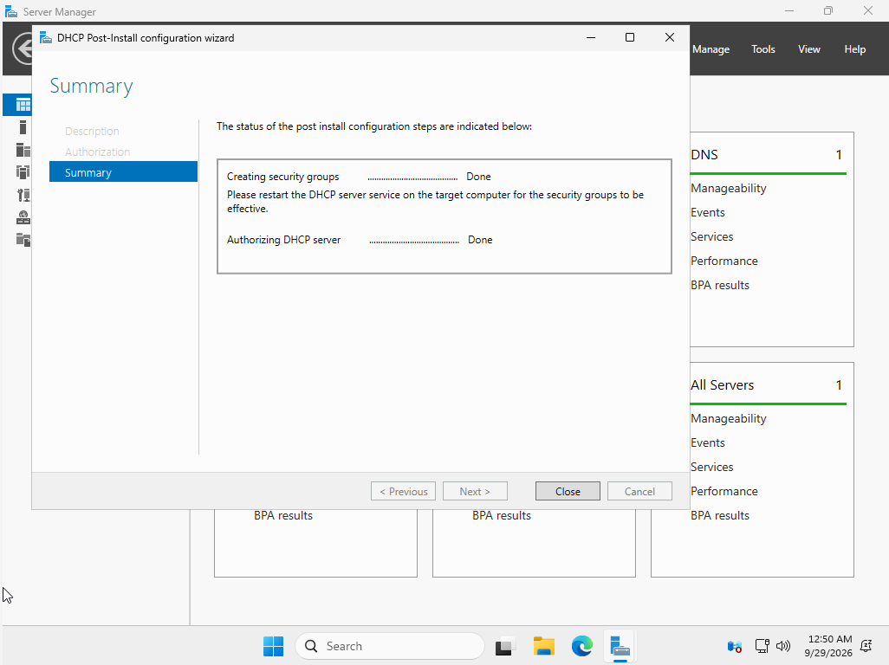
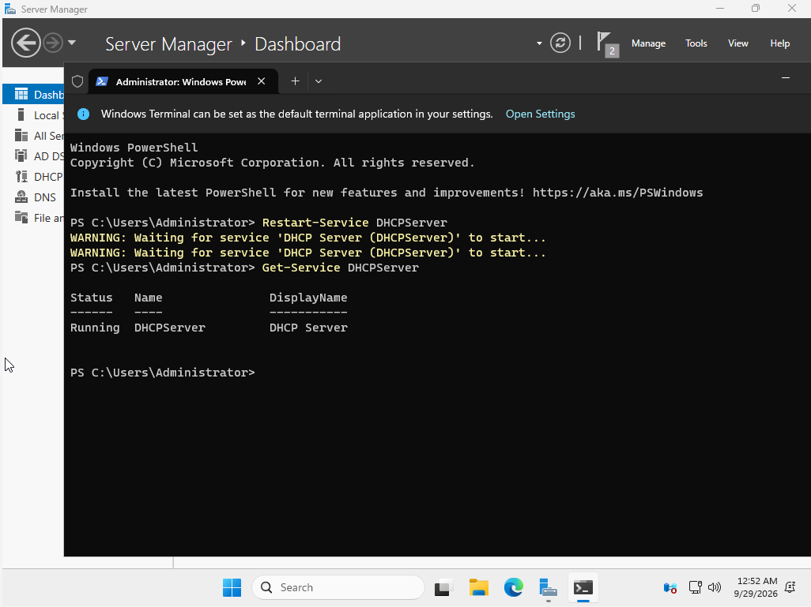
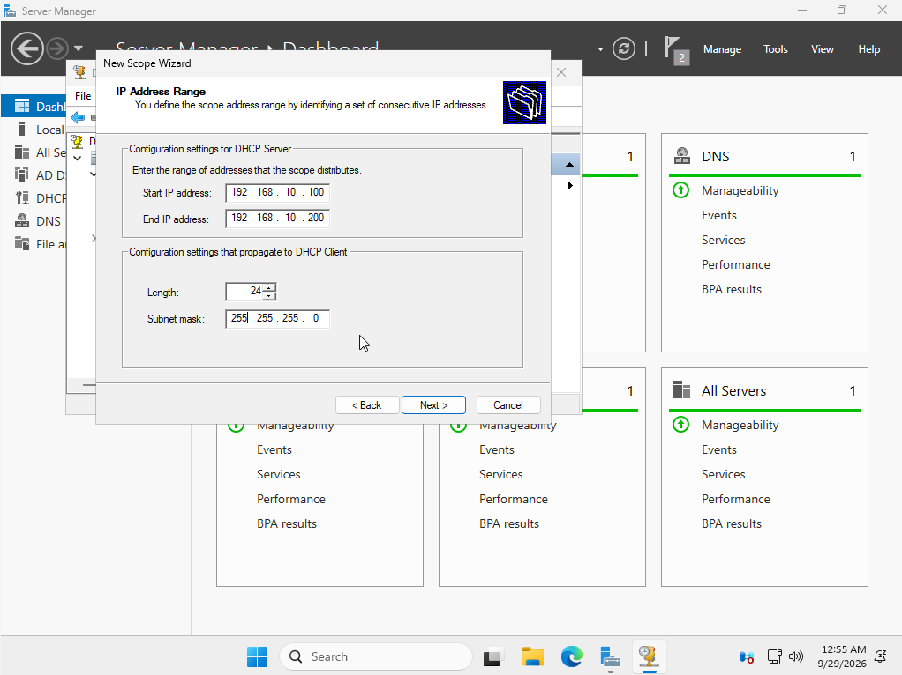
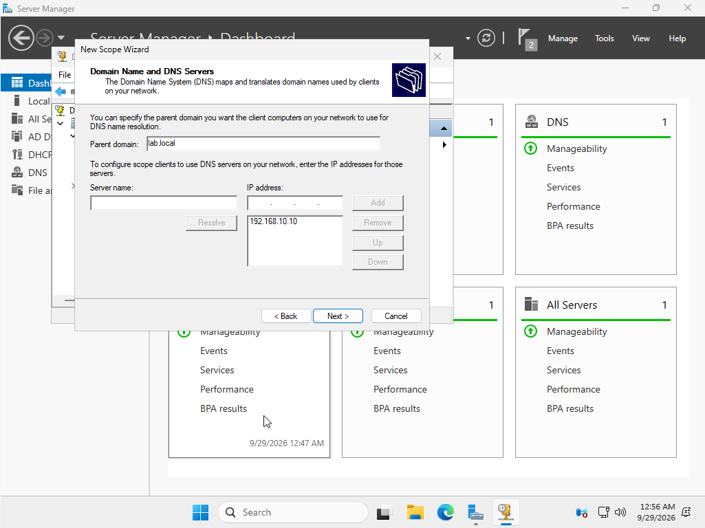
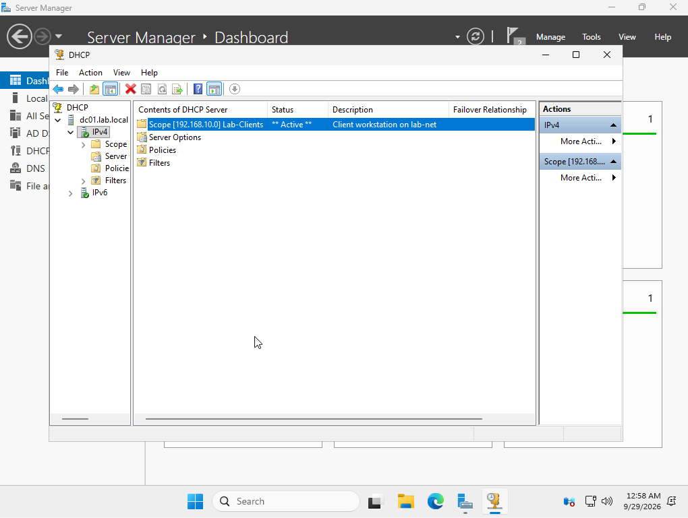

# 2. DNS and DHCP

[← Domain Controller](01-domain-controller.md) | [Back to README](../README.md) | [Next: Users and Groups →](03-users-and-groups.md)

DNS was installed with Active Directory. This page adds DHCP, so client PCs get an IP address, DNS server, and domain name automatically, the same way they would in an office.

## Installing the DHCP Role



## Authorizing DHCP in Active Directory

On a domain network, a DHCP server must be **authorized** in Active Directory before it hands out any addresses. This stops a rogue DHCP server, like a home router someone plugs in, from giving clients bad addresses.



The wizard asked for a service restart so the new DHCP security groups would take effect. I did it with PowerShell:

```powershell
Restart-Service DHCPServer
Get-Service DHCPServer
```



## Creating the Scope

| Setting | Value |
|---|---|
| Scope name | Lab-Clients |
| Address range | 192.168.10.100 to 192.168.10.200 |
| Subnet mask | 255.255.255.0 (/24) |
| Lease duration | 8 days |
| Router (gateway) | none (isolated network) |
| DNS server | 192.168.10.10 |
| DNS domain name | lab.local |

While entering the range, I caught a typo in the end address (`192.160.10.200` instead of `192.168.10.200`) and fixed it before moving on. A scope with a wrong range would have failed to create or handed out unusable addresses.



The DNS option is the most important one. Clients must use DC01 for DNS, or they can't find the domain.





> **Later update:** after a reboot, this DHCP server started before Active Directory was ready and stopped serving addresses. I fixed it by setting the service to delayed start. See [Ticket 4: DHCP outage](../scenarios/04-dhcp-outage.md).

[Next: Users and Groups →](03-users-and-groups.md)
