# 3. Users and Groups

[← DNS and DHCP](02-dns-dhcp.md) | [Back to README](../README.md) | [Next: Group Policy and Shares →](04-group-policy-and-shares.md)

This page builds the "company": an OU structure, one user created by hand, 10 users created in bulk with PowerShell, and a security group for each department.

## OU Design

Real companies don't keep users in the default folders. I created a parent OU called `_LAB` (the underscore keeps it at the top of the list) and six OUs inside it, each with a description so the next admin knows what it's for.

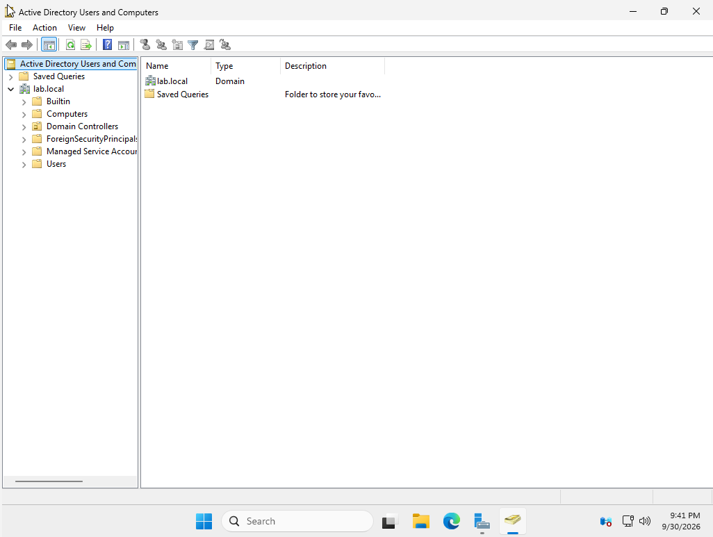

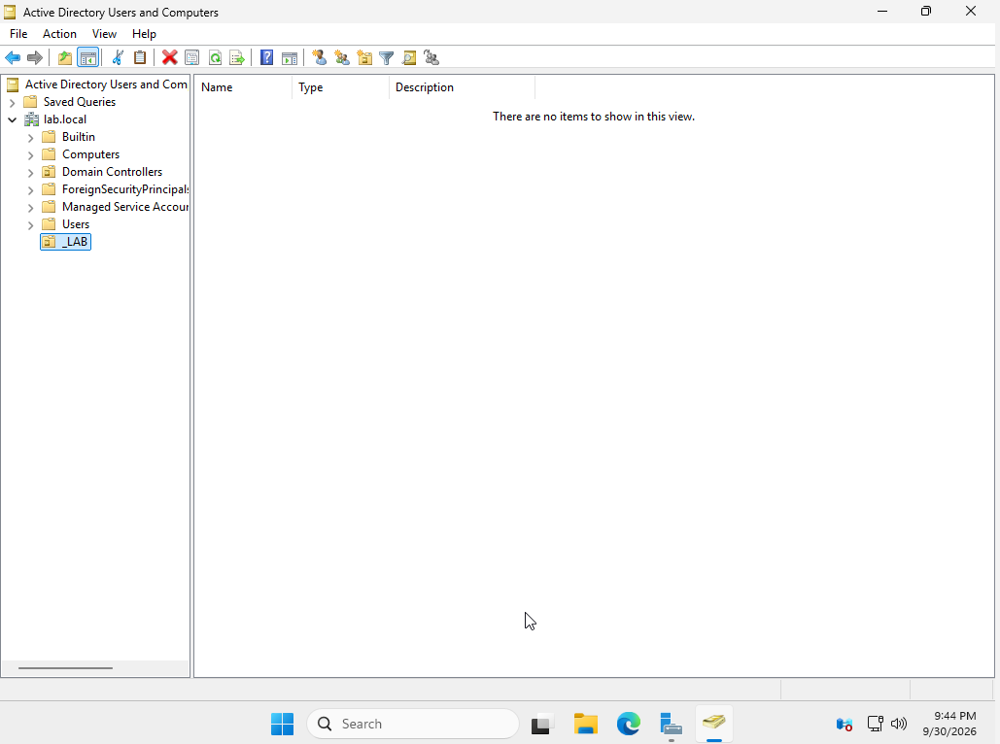

| OU | Purpose |
|---|---|
| HR | Human Resources employees |
| Finance | Finance employees |
| IT | IT staff |
| Groups | Security groups |
| Workstations | Employee computers |
| Terminated | Disabled accounts of people who left the company |

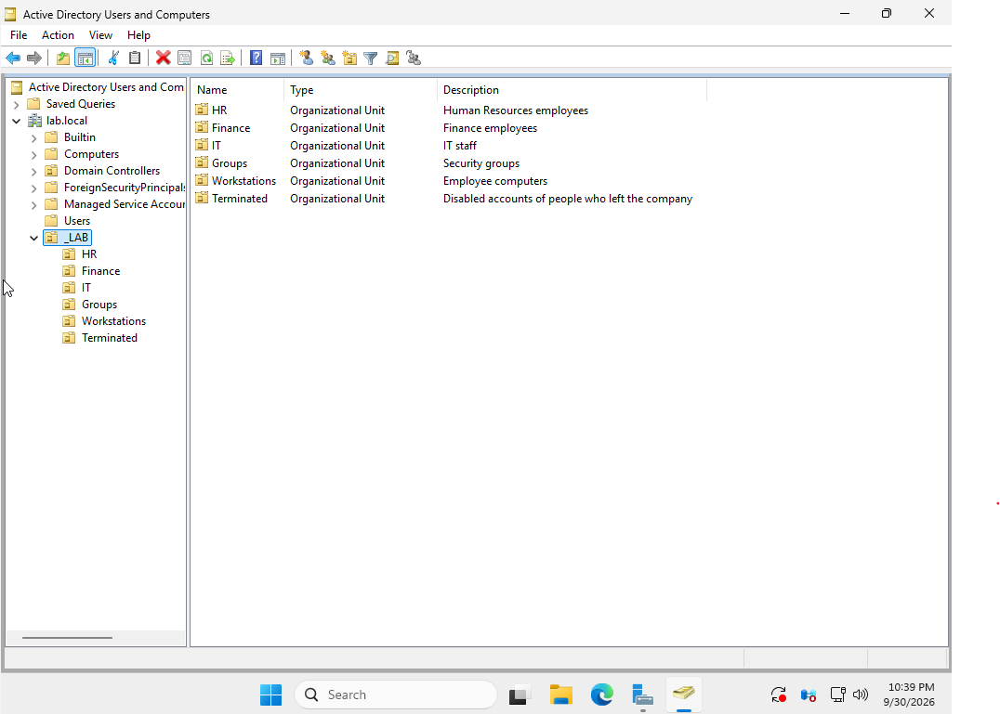

## Creating a User by Hand

I created my own account in the IT OU through the GUI first, to learn every field before automating it.

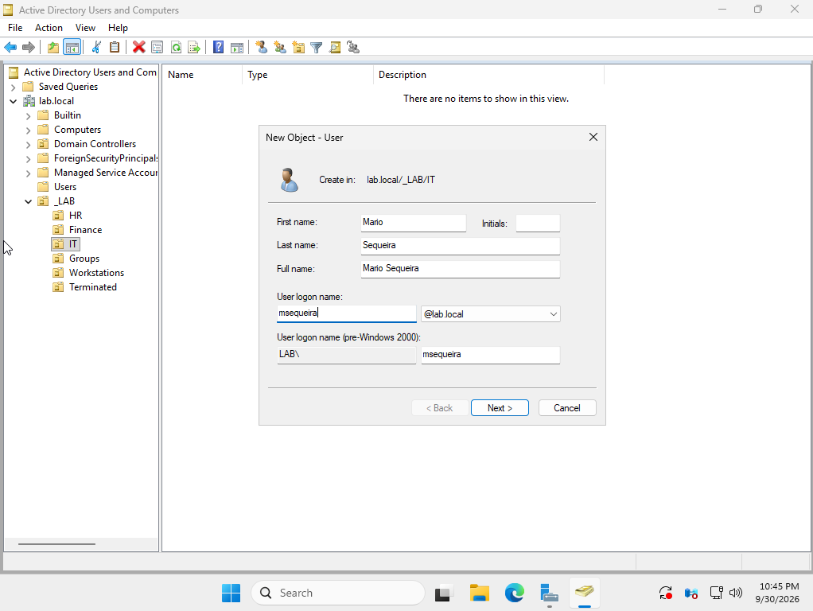

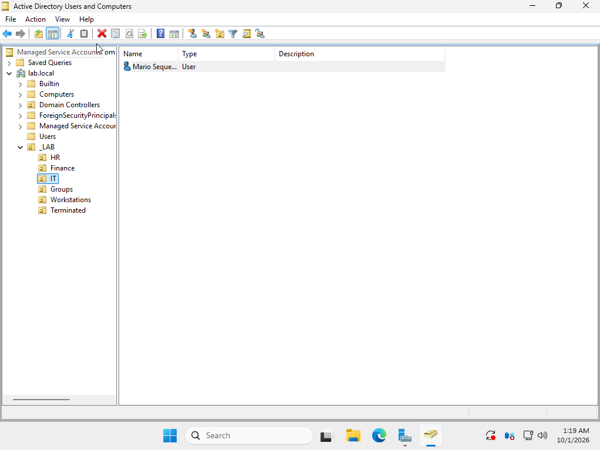

## Bulk Onboarding with PowerShell

To copy and paste scripts into the VM, I installed VirtualBox Guest Additions and turned on the shared clipboard.

### The User List

New hires came from a CSV file, the way HR might send them to IT: 10 fictional employees across HR, Finance, and IT.

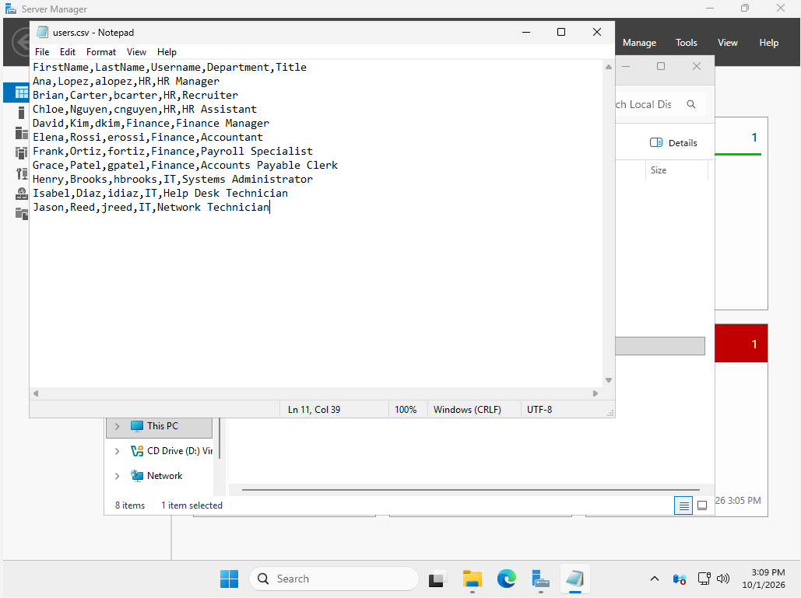

### The Onboarding Script

[`New-UserOnboarding.ps1`](../scripts/New-UserOnboarding.ps1) reads the CSV and, for each person:

- creates the account in their department OU
- sets a temporary password they must change at first sign-in
- adds them to their department security group (`SG-HR`, `SG-Finance`, `SG-IT`), creating the groups if needed
- skips anyone who already exists
- writes every action to a log file

The script **prompts** for the temporary password instead of storing it in the file, so the script is safe to publish.

### First Run Failed

The first run created the three groups, then failed on all 10 users: *"The password does not meet the length, complexity, or history requirement of the domain."* The password prompt showed a single `*`, so only one character had been entered.

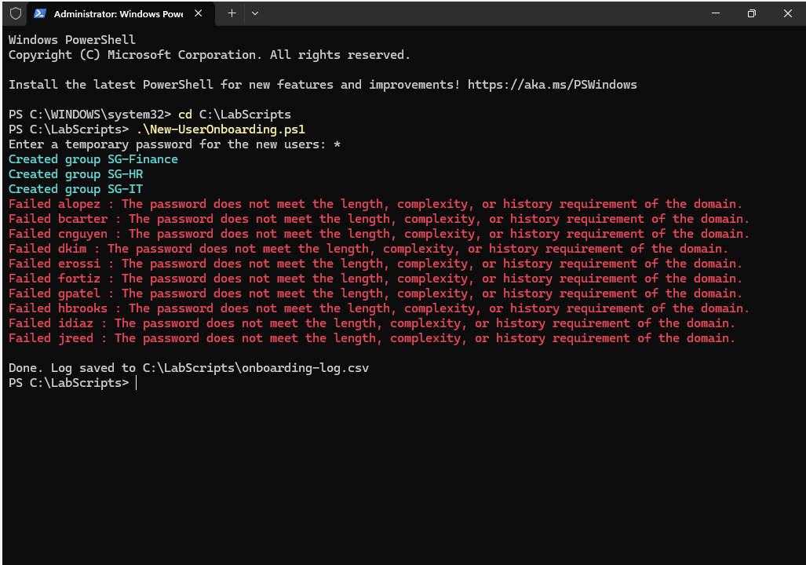

The failure left a mess behind. When I checked the `_LAB` OU, all 10 accounts existed but were **disabled with no password**: Windows had created each account, then failed to set its password. A rerun would have skipped them as "already exists."

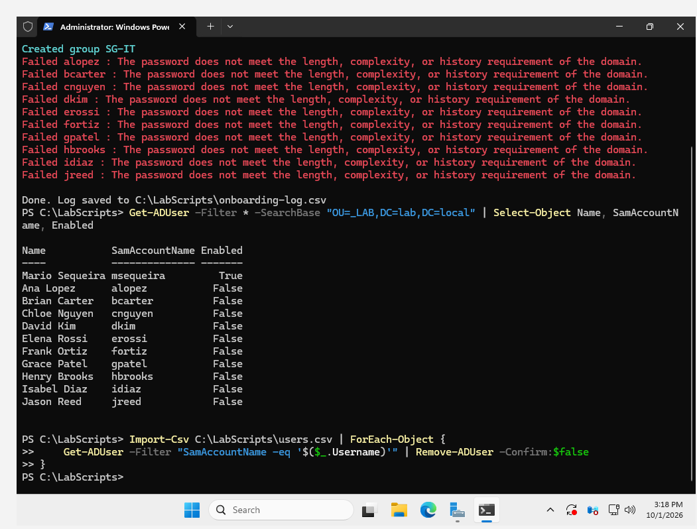

I removed only the accounts listed in the CSV, so my own account stayed untouched:

```powershell
Import-Csv C:\LabScripts\users.csv | ForEach-Object {
    Get-ADUser -Filter "SamAccountName -eq '$($_.Username)'" | Remove-ADUser -Confirm:$false
}
```

### Second Run

After confirming only my account remained, I reran the script and typed a valid temporary password. All 10 users were created.

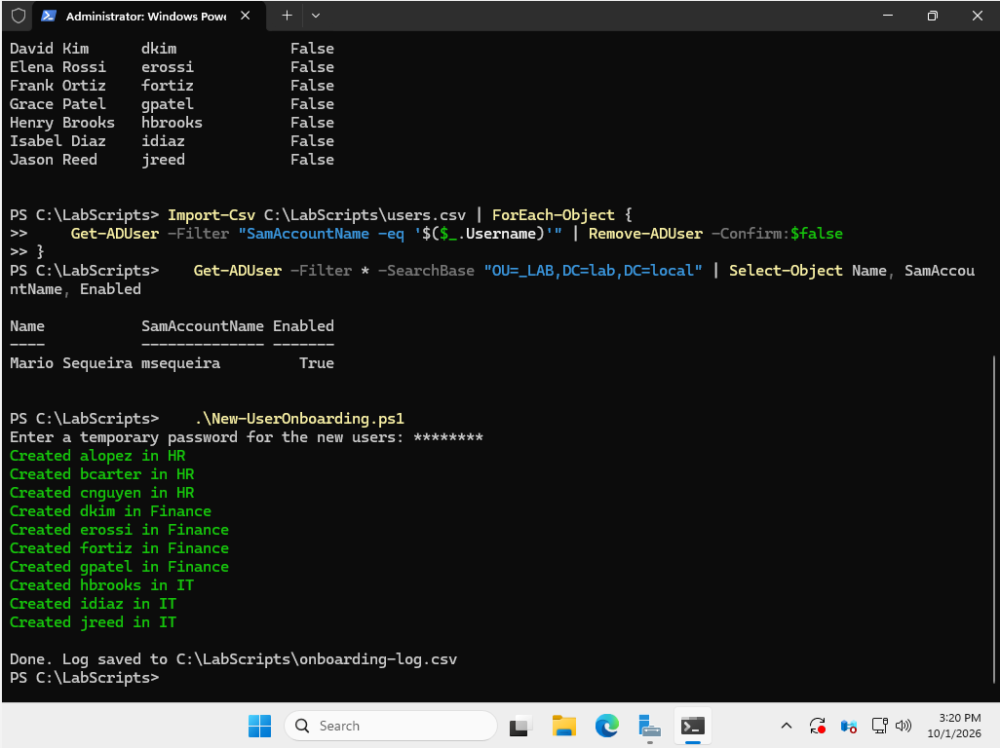

**Lesson:** validate input before changing anything. A v2 of the script should test the password against the domain policy before creating a single account.

## Verifying in the GUI

Scripts can report success while something is off, so I checked the result in Active Directory Users and Computers.

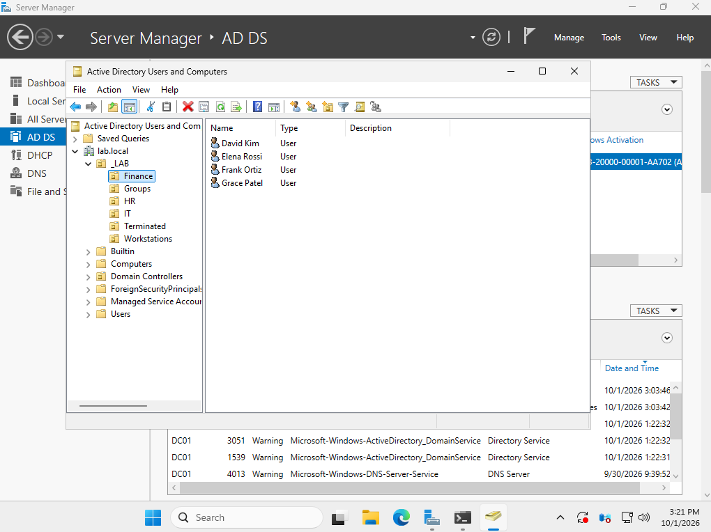

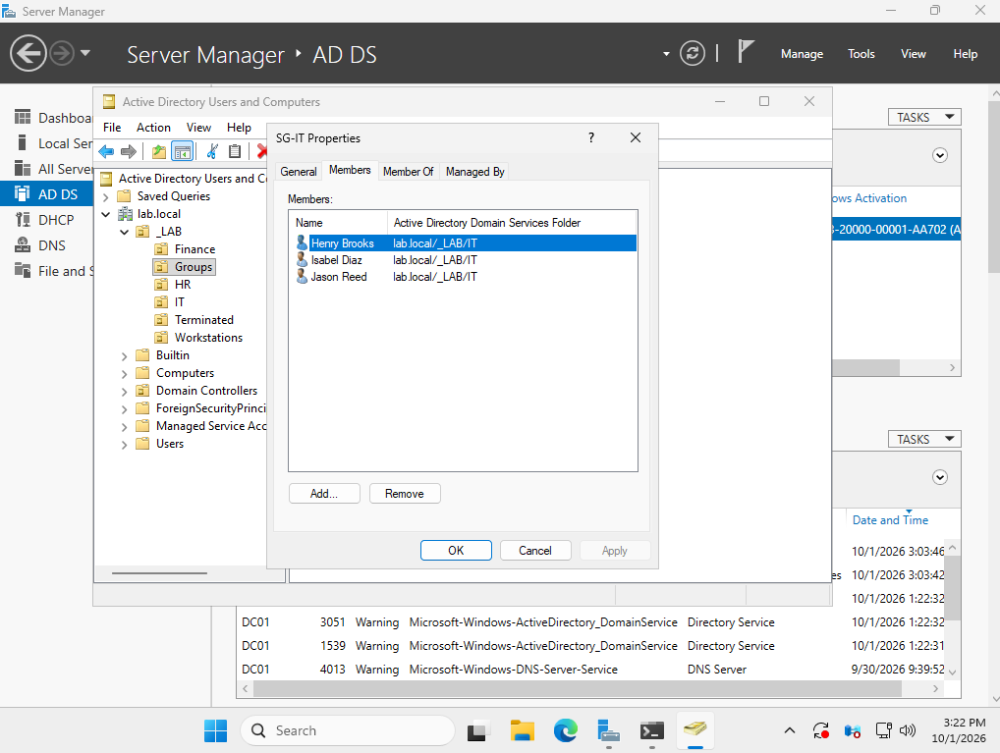

My own account was created by hand, so the script didn't add it to a group. I added myself to SG-IT, the way a help desk tech would fix a missed group membership.

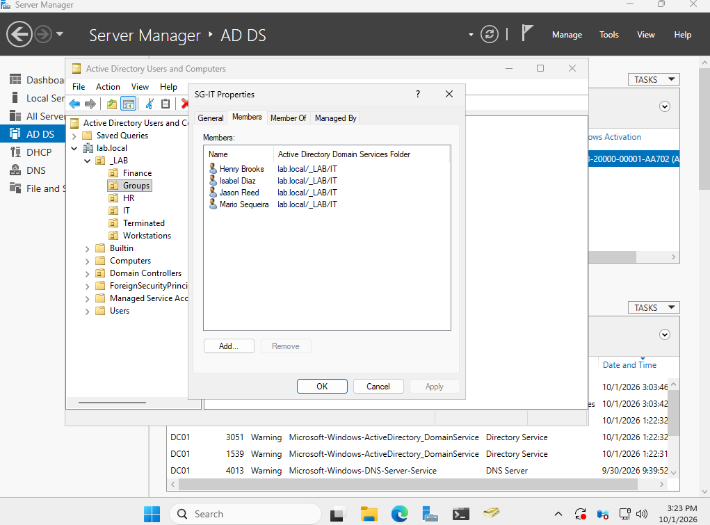

## Result

| Department | Users | Group |
|---|---|---|
| HR | Ana Lopez, Brian Carter, Chloe Nguyen | SG-HR |
| Finance | David Kim, Elena Rossi, Frank Ortiz, Grace Patel | SG-Finance |
| IT | Mario Sequeira, Henry Brooks, Isabel Diaz, Jason Reed | SG-IT |

[Next: Group Policy and Shares →](04-group-policy-and-shares.md)
