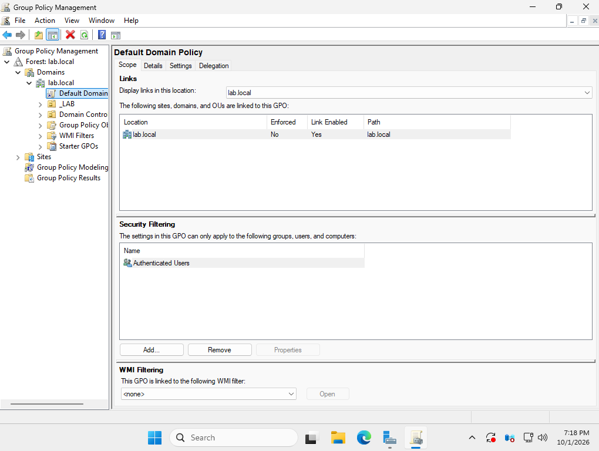
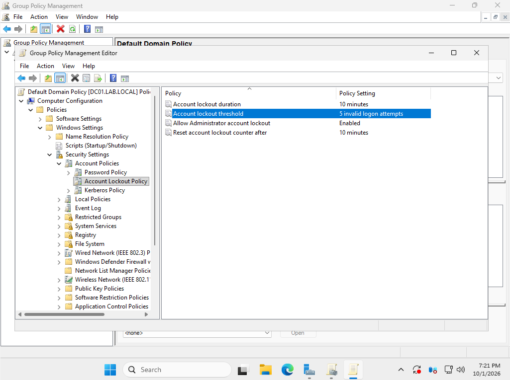
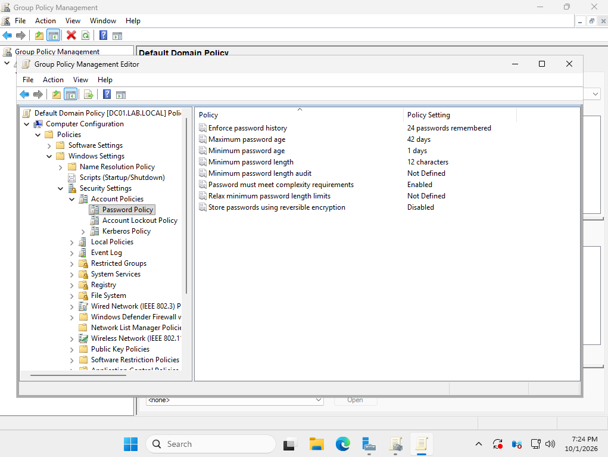
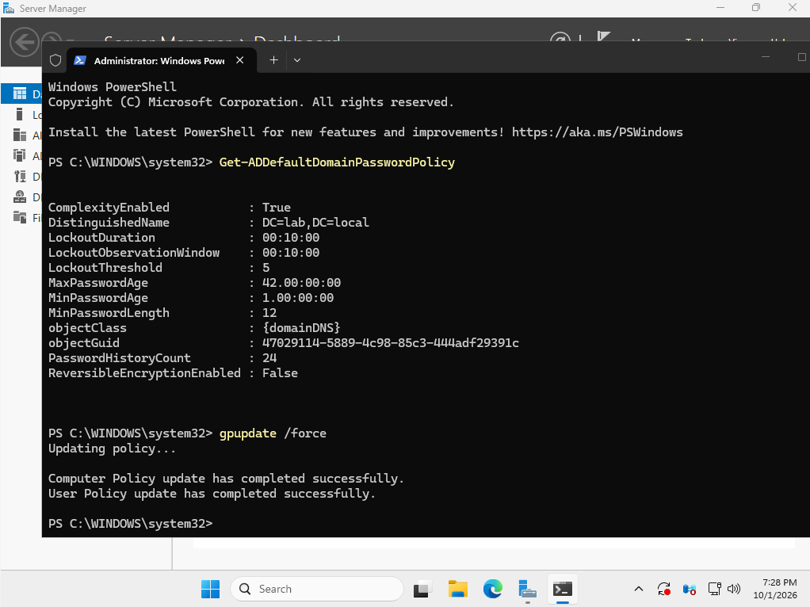
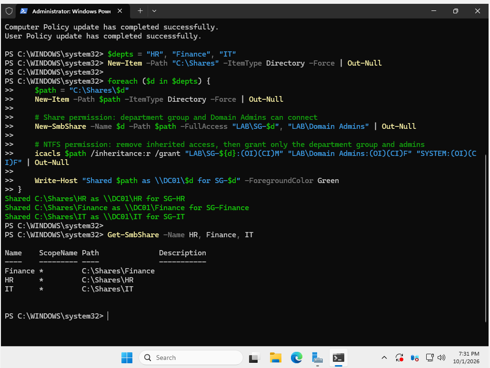
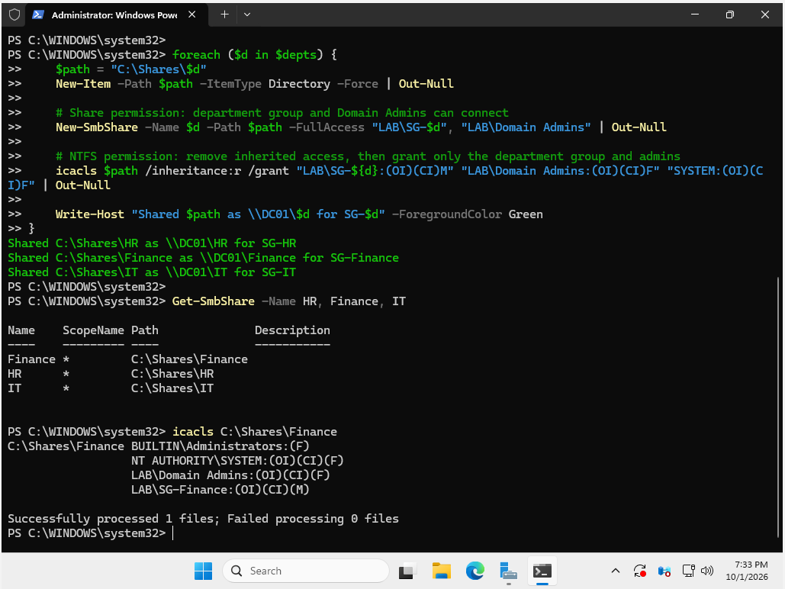
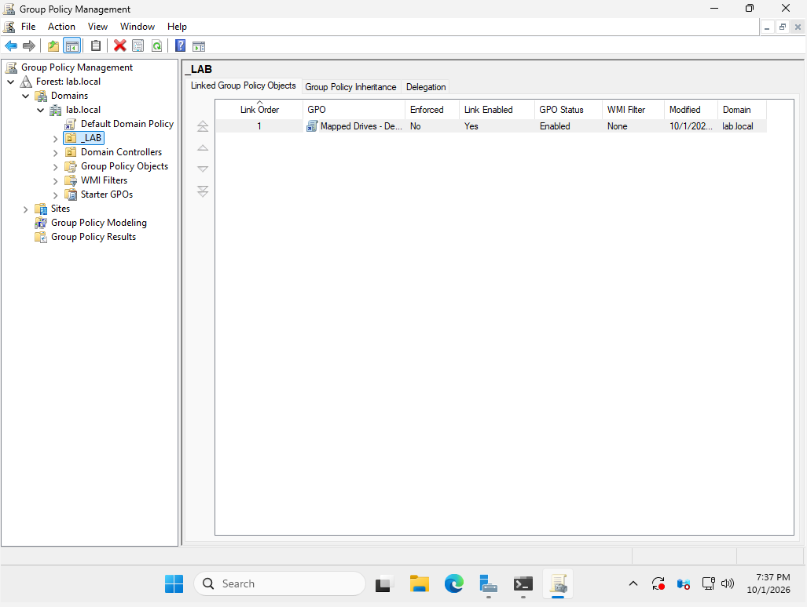
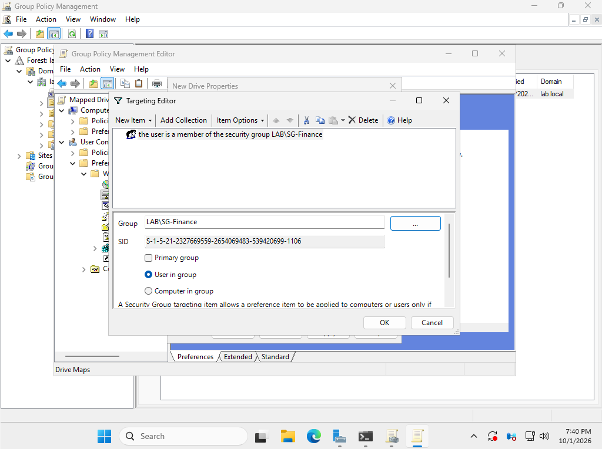
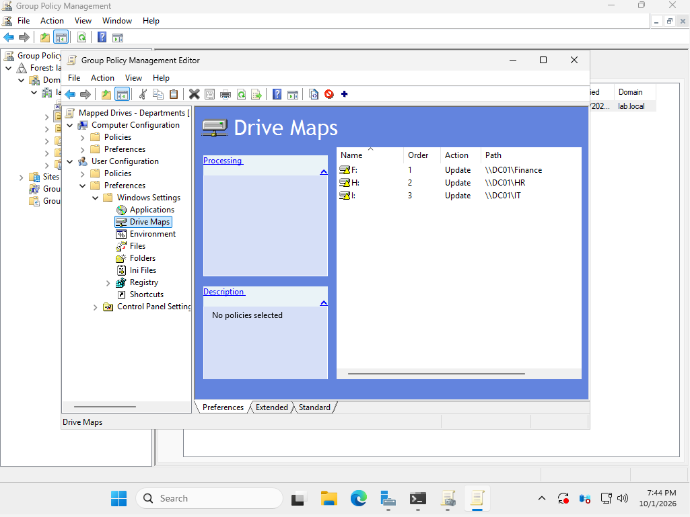

# 4. Group Policy and Shares

[← Users and Groups](03-users-and-groups.md) | [Back to README](../README.md) | [Next: Client and Domain Join →](05-client-and-domain-join.md)

This page sets the domain password and lockout rules, creates a locked-down file share for each department, and uses Group Policy to map each department's drive automatically.

## Password and Lockout Policy

Password and lockout settings for domain accounts only take effect at the **domain level**, so I set them in the **Default Domain Policy** instead of on an OU.



### Account Lockout Policy

| Setting | Value | Meaning |
|---|---|---|
| Account lockout threshold | 5 invalid attempts | 5 wrong passwords lock the account |
| Account lockout duration | 10 minutes | The account unlocks on its own after 10 minutes |
| Reset lockout counter after | 10 minutes | Failed attempts reset after 10 quiet minutes |
| Allow Administrator account lockout | Enabled | Even the built-in Administrator can be locked out |



### Password Policy

I raised the minimum length from the default of 7 to **12 characters**, since longer passwords matter more than complex ones. The new minimum applies the next time each user changes their password.

| Setting | Value |
|---|---|
| Enforce password history | 24 passwords |
| Maximum password age | 42 days |
| Minimum password age | 1 day |
| Minimum password length | 12 characters |
| Complexity requirements | Enabled |



I pushed the policy with `gpupdate /force` and confirmed the domain picked it up:

```powershell
gpupdate /force
Get-ADDefaultDomainPasswordPolicy
```



## Department File Shares

A network share has **two layers of permissions**, and both must allow access:

- **Share permissions:** who can connect over the network
- **NTFS permissions:** who can open the files once connected

When they disagree, the more restrictive one wins.

This script creates `C:\Shares\HR`, `Finance`, and `IT`, shares each one, and locks it to its department group:

```powershell
$depts = "HR", "Finance", "IT"
New-Item -Path "C:\Shares" -ItemType Directory -Force | Out-Null

foreach ($d in $depts) {
    $path = "C:\Shares\$d"
    New-Item -Path $path -ItemType Directory -Force | Out-Null

    # Share permission: department group and Domain Admins can connect
    New-SmbShare -Name $d -Path $path -FullAccess "LAB\SG-$d", "LAB\Domain Admins" | Out-Null

    # NTFS permission: remove inherited access, then grant only the department group and admins
    icacls $path /inheritance:r /grant "LAB\SG-${d}:(OI)(CI)M" "LAB\Domain Admins:(OI)(CI)F" "SYSTEM:(OI)(CI)F" | Out-Null

    Write-Host "Shared $path as \\DC01\$d for SG-$d" -ForegroundColor Green
}

Get-SmbShare -Name HR, Finance, IT
```

`/inheritance:r` matters most here. Without it, every domain user would inherit read access from `C:\` and could open every department's files.



| Entry on C:\Shares\Finance | Access |
|---|---|
| LAB\SG-Finance | Modify (create, edit, delete files) |
| LAB\Domain Admins | Full control |
| NT AUTHORITY\SYSTEM | Full control |
| BUILTIN\Administrators | Full control (this folder only) |

No "Users" or "Everyone" entries, so nobody outside Finance gets in.



## Mapping Drives by Department

One GPO, **Mapped Drives - Departments**, maps the right drive for each person. I linked it to the `_LAB` OU, so it applies to every employee.



Each drive map uses **item-level targeting**: the drive only maps if the user is in that department's security group.

| Drive | Path | Applies to |
|---|---|---|
| F: | `\\DC01\Finance` | members of SG-Finance |
| H: | `\\DC01\HR` | members of SG-HR |
| I: | `\\DC01\IT` | members of SG-IT |





The client-side tests for all of this are on the next page.

[Next: Client and Domain Join →](05-client-and-domain-join.md)
