# 5. Client and Domain Join

[← Group Policy and Shares](04-group-policy-and-shares.md) | [Back to README](../README.md)

This page builds CLIENT01, a Windows 11 workstation, fixes a DNS problem on the domain controller, joins the client to the domain, and tests everything from a user's chair.

## CLIENT01 VM

| Setting | Value |
|---|---|
| OS | Windows 11 Enterprise Evaluation |
| Memory | 4096 MB |
| CPUs | 2 |
| Disk | 80 GB |
| Firmware | EFI, Secure Boot, TPM 2.0 (Windows 11 requires all three) |
| Network | Internal Network `lab-net` only, no internet |

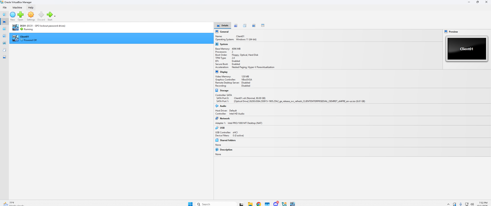

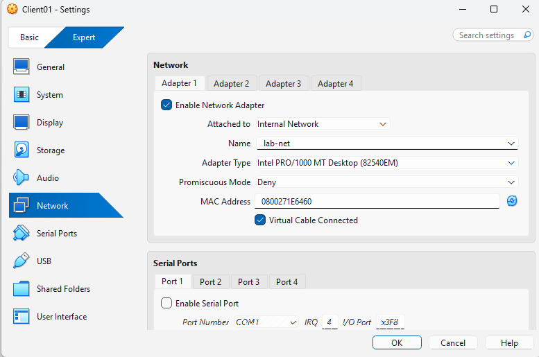

With no internet, I completed Windows setup offline and created a local account, `localadmin`. Every domain PC should have a local admin account like this: it's the way in when domain logins break (see [Ticket 6](../scenarios/06-trust-relationship-failed.md)).

## Checking the Network

Before joining the domain, I confirmed CLIENT01 could reach DC01.

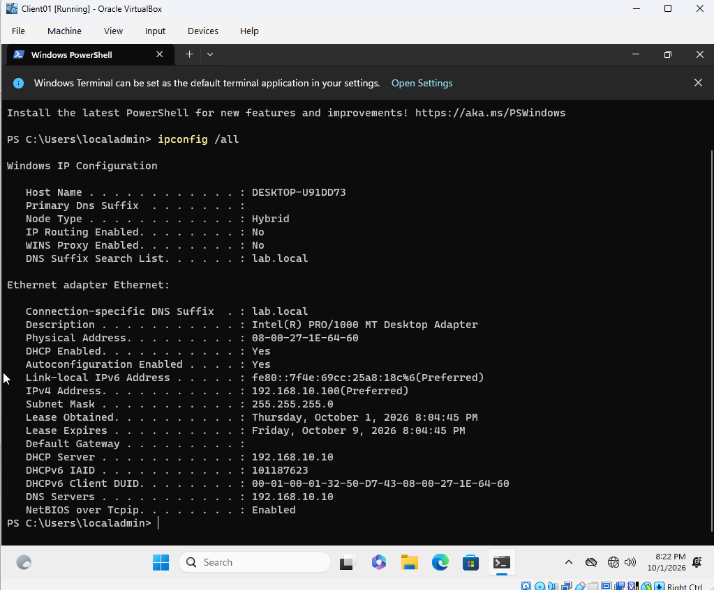

DHCP worked: CLIENT01 got `192.168.10.100`, the first address in the scope, with DC01 as its DNS server. The ping worked too, but `nslookup lab.local` returned **three** addresses:

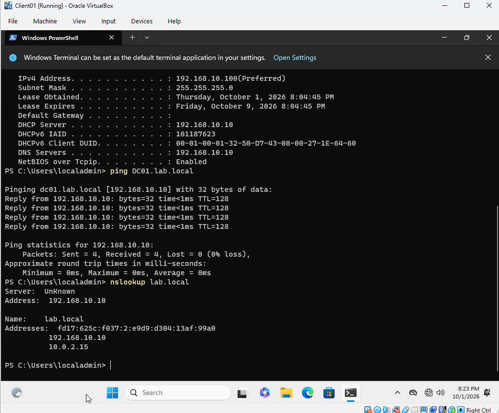

- `192.168.10.10`, DC01 on the lab network (correct)
- `10.0.2.15`, DC01's NAT adapter, which CLIENT01 can't reach
- an `fd17:` IPv6 address, also from the NAT adapter

## Fixing DNS on a Multi-Homed Domain Controller

DC01 has two network cards (it's **multi-homed**) and registered both in DNS. If DNS hands a client the NAT address, domain joins, logins, and Group Policy can fail at random. I fixed it on DC01:

```powershell
# Stop the NAT adapter from registering itself in DNS
Set-DnsClient -InterfaceAlias "Internet-NAT" -RegisterThisConnectionsAddress $false

# Make the DNS server answer only on the lab network
dnscmd /ResetListenAddresses 192.168.10.10
Restart-Service DNS

# Delete the records that already existed
Get-DnsServerResourceRecord -ZoneName lab.local -RRType A | Where-Object { $_.RecordData.IPv4Address -eq "10.0.2.15" } | Remove-DnsServerResourceRecord -ZoneName lab.local -Force
Get-DnsServerResourceRecord -ZoneName lab.local -RRType AAAA | Where-Object { $_.RecordData.IPv6Address -like "fd17*" } | Remove-DnsServerResourceRecord -ZoneName lab.local -Force

# Verify
Resolve-DnsName lab.local -Server 192.168.10.10
```

My first attempt failed with a red error because two commands got pasted onto one line. I reran them separately.

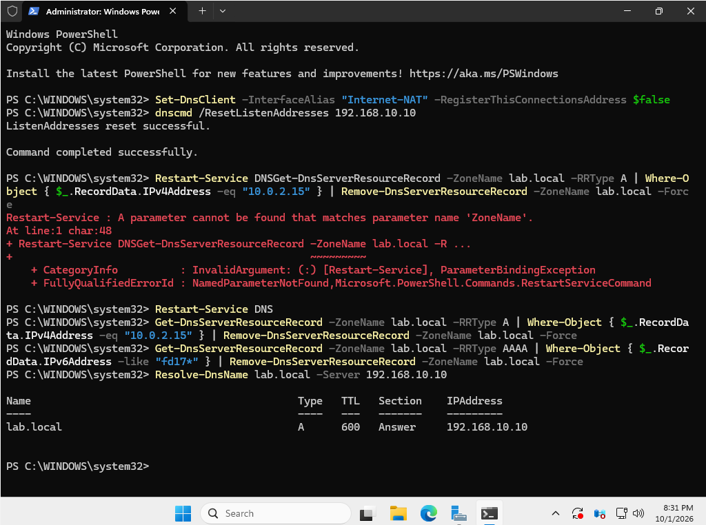

After clearing the client's DNS cache, `lab.local` resolved to `192.168.10.10` only. The fix held after DC01 rebooted.

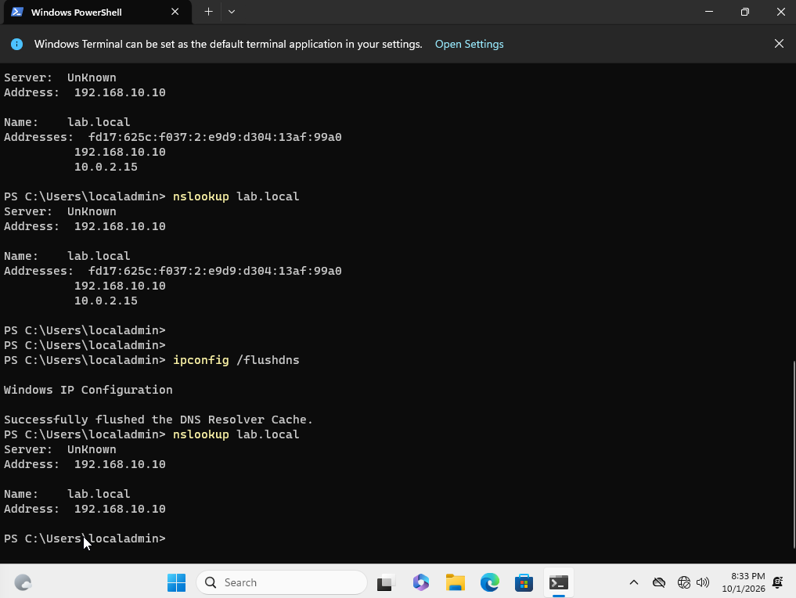

## Joining the Domain

One command renamed the PC, joined it to `lab.local`, and placed it in the Workstations OU instead of the default Computers folder:

```powershell
Add-Computer -DomainName lab.local -NewName CLIENT01 -OUPath "OU=Workstations,OU=_LAB,DC=lab,DC=local" -Credential LAB\Administrator
Restart-Computer
```

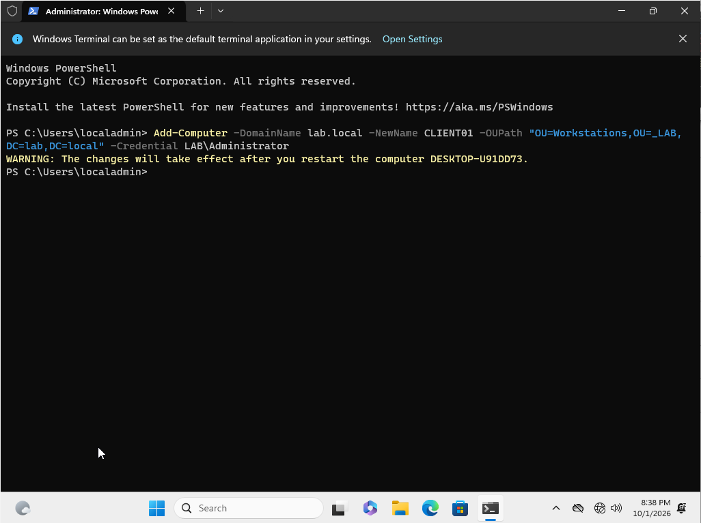

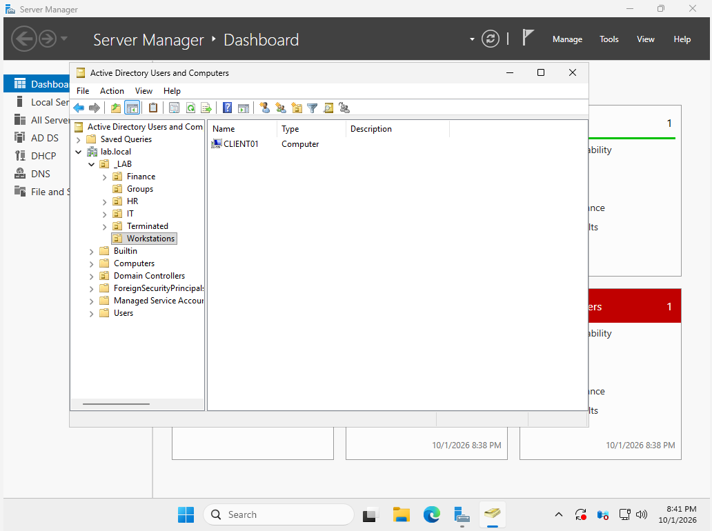

## Testing as a User

I signed in as **Frank Ortiz** (Finance) for the first time.

**Password policy:** Windows forced a password change at first sign-in, and rejected a short password with the 12-character minimum.

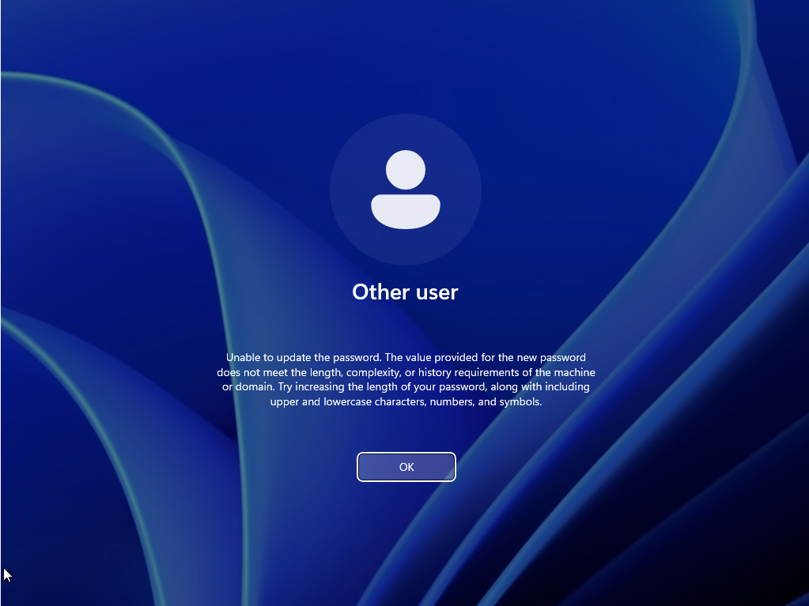

**Drive mapping:** as a Finance user, Frank got the **F:** drive.

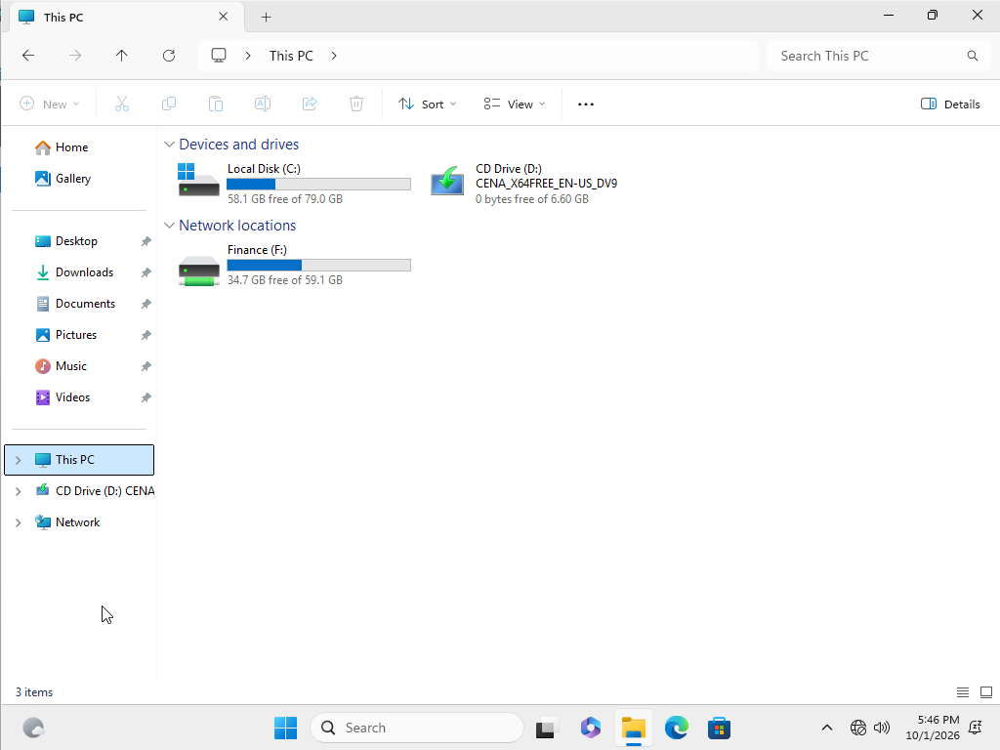

**Share permissions:** Frank could open and create files in `\\DC01\Finance`, but `\\DC01\HR` returned "You do not have permission to access."

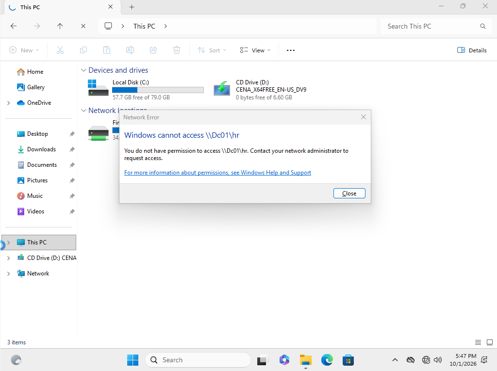

The build was complete: right drive, write access to his own department, and other departments blocked. Next came the [help desk tickets](../README.md#help-desk-tickets).
