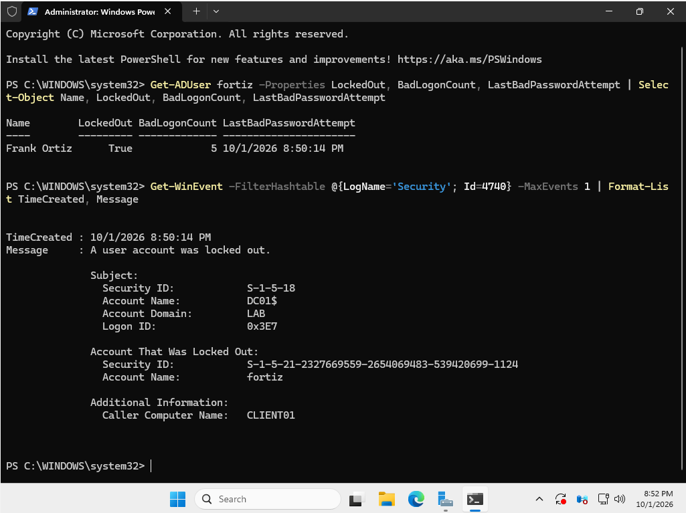
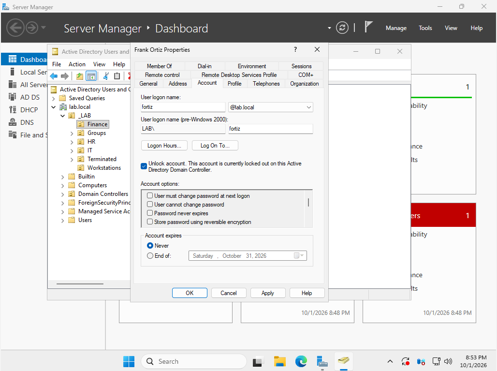

# Ticket 1: User Locked Out

[← Back to README](../README.md) | [Next ticket →](02-expired-evaluation-license.md)

| | |
|---|---|
| **Reported by** | Frank Ortiz, Finance |
| **Symptom** | "The referenced account is currently locked out and may not be logged on to." |
| **Root cause** | 5 failed sign-ins tripped the domain lockout policy |
| **Resolution** | Confirmed the source, then unlocked the account in ADUC |

## Symptom

After 5 wrong passwords, even the correct password failed with a lockout message.


## Investigation

First I confirmed the lockout and when it happened:

```powershell
Get-ADUser fortiz -Properties LockedOut, BadLogonCount, LastBadPasswordAttempt |
    Select-Object Name, LockedOut, BadLogonCount, LastBadPasswordAttempt
```

Result: `LockedOut: True`, `BadLogonCount: 5`, last bad attempt at **8:50:14 PM**.

Then I found **which computer** caused it. In real offices, lockouts often come from an old password saved on a phone or a second PC, so the source matters.

```powershell
Get-WinEvent -FilterHashtable @{LogName='Security'; Id=4740} -MaxEvents 1 |
    Format-List TimeCreated, Message
```

Event **4740** ("A user account was locked out") showed the same time, **8:50:14 PM**, with **Caller Computer Name: CLIENT01**. The matching timestamps tie the lockout to that exact event and machine.



## Resolution

In Active Directory Users and Computers: Frank Ortiz > Properties > **Account** tab > **Unlock account**.



## Verification

`LockedOut` changed to `False`, and Frank signed in with his correct password.


## Prevention

Advise the user to check other devices (phone, second PC, saved credentials) for an old password. If lockouts repeat, event 4740 points to the device causing them.
