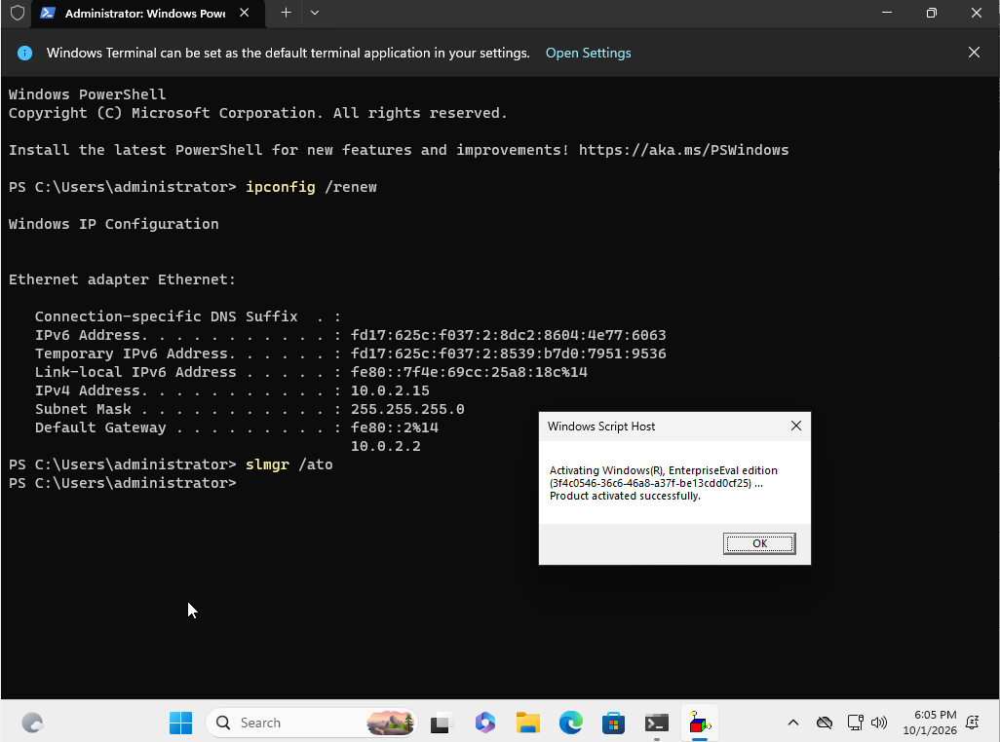
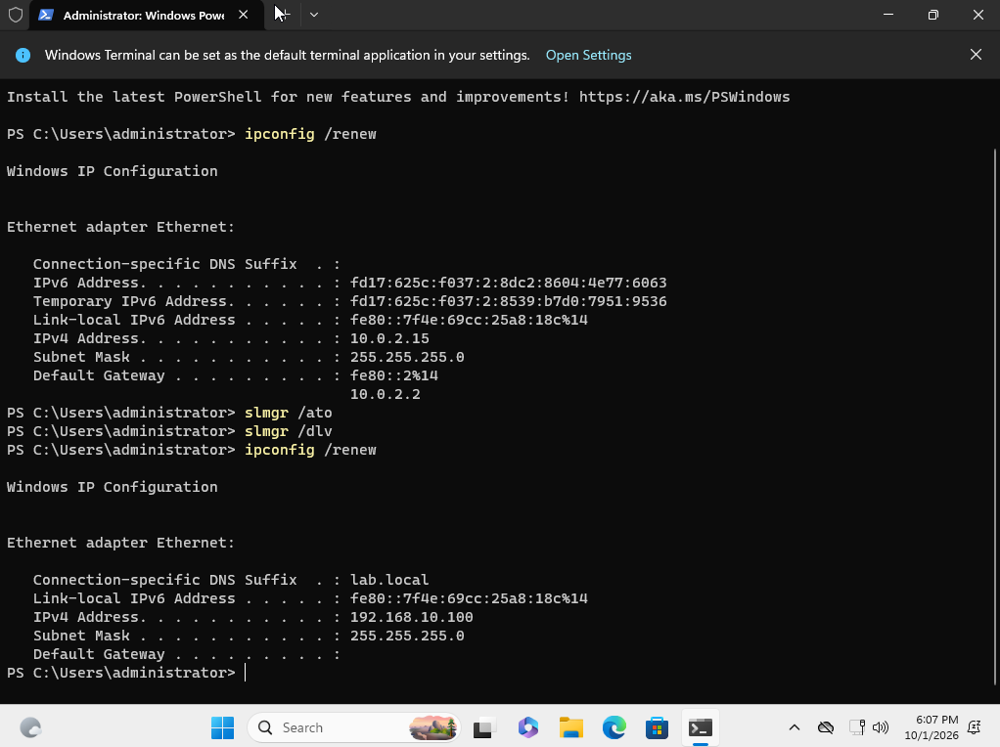
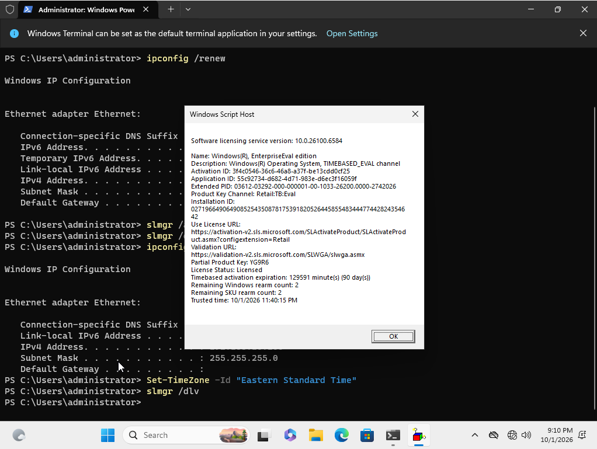

# Ticket 2: Windows License Expired

[← Previous ticket](01-account-lockout.md) | [Back to README](../README.md) | [Next ticket →](03-password-reset.md)

| | |
|---|---|
| **Found by** | Me, while working on CLIENT01 |
| **Symptom** | Desktop watermark: "Windows License is expired" |
| **Root cause** | The evaluation copy never activated online, so its grace period ran out |
| **Resolution** | Temporary internet access, then online activation with `slmgr /ato` |

This ticket wasn't planned. An expired evaluation copy of Windows shuts down about every hour, which would have interrupted the other tickets, so I fixed it first.

## Investigation

```
slmgr /dlv
```

The license details showed:

- **License Status:** Notification
- **Notification Reason:** `0xC004F009` (grace time expired)
- **Remaining Windows rearm count:** 2

An evaluation copy must activate online to start its 90-day trial. CLIENT01 has no internet by design, so it never activated, and its grace period ran out.

## Resolution

1. Switched CLIENT01's adapter from `lab-net` to NAT in VirtualBox, and ran `ipconfig /renew` to get an internet address.
2. Activated:
   ```
   slmgr /ato
   ```
   Result: "Product activated successfully."



3. Switched the adapter back to `lab-net` and ran `ipconfig /renew`. CLIENT01 returned to `192.168.10.100`.



I also fixed CLIENT01's time zone, which was set to Pacific:

```powershell
Set-TimeZone -Id "Eastern Standard Time"
```

## Verification

`slmgr /dlv` showed **License Status: Licensed** with 90 days remaining, and both rearms still available as a backup.


