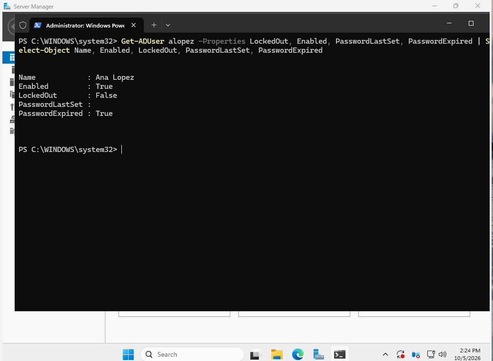
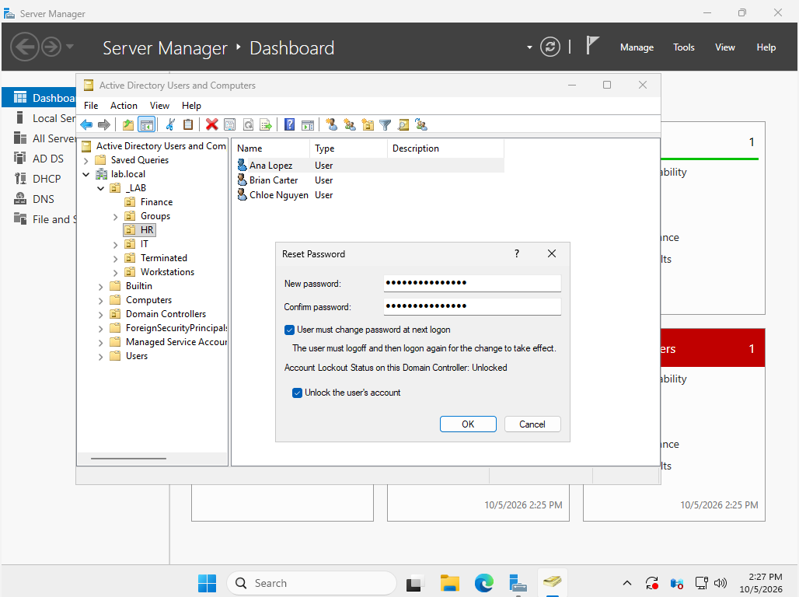
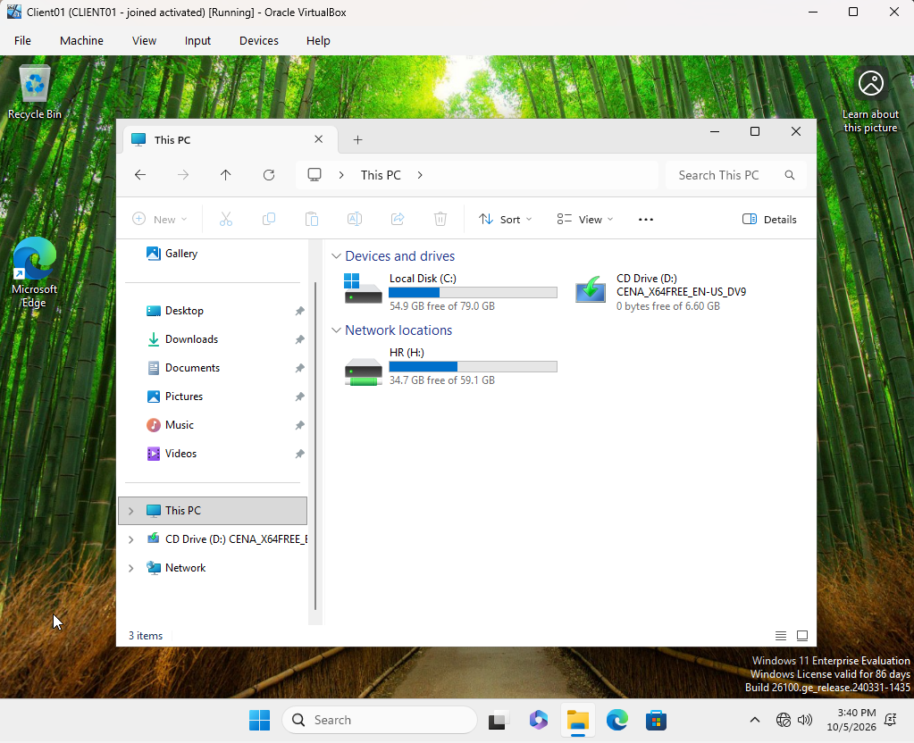
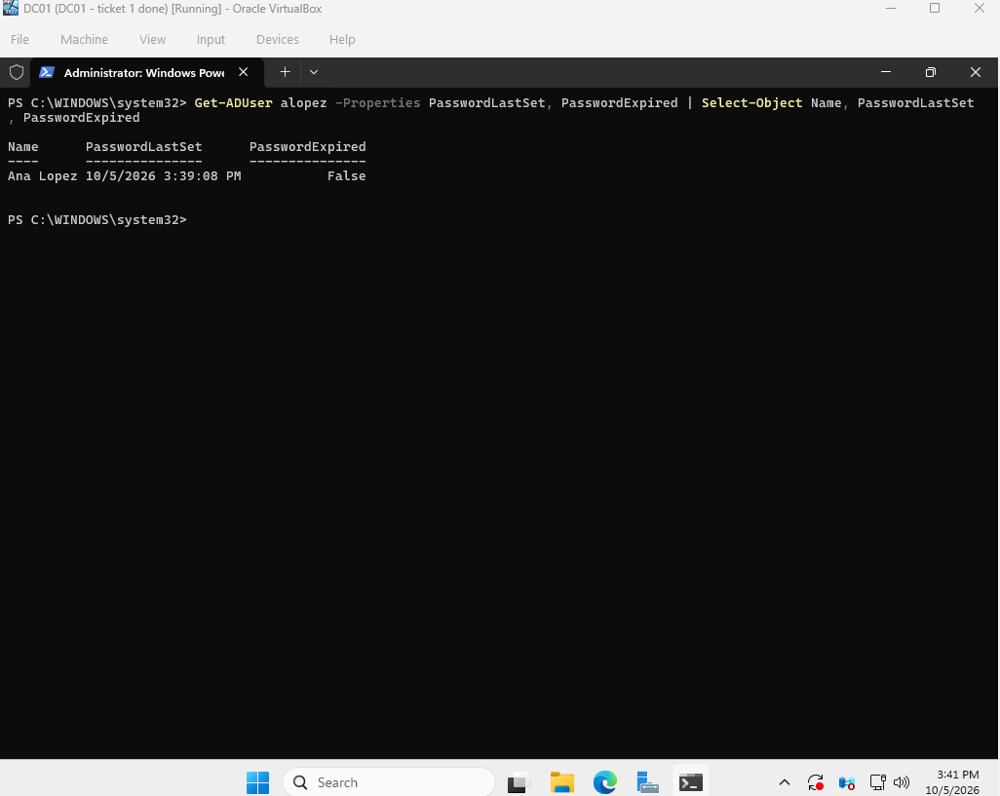

# Ticket 3: Forgotten Password

[← Previous ticket](02-expired-evaluation-license.md) | [Back to README](../README.md) | [Next ticket →](04-dhcp-outage.md)

| | |
|---|---|
| **Reported by** | Ana Lopez, HR Manager |
| **Symptom** | Back from vacation, can't remember her password |
| **Resolution** | Reset to a temporary password, user sets her own at next sign-in |

## Verify the Caller

On a real help desk, the first step is confirming the caller is really Ana (employee ID, or a callback to her desk phone) before touching the account. Resetting a password for someone who only *claims* to be Ana is how attackers get in.

## Investigation

```powershell
Get-ADUser alopez -Properties LockedOut, Enabled, PasswordLastSet, PasswordExpired |
    Select-Object Name, Enabled, LockedOut, PasswordLastSet, PasswordExpired
```

- `Enabled: True` and `LockedOut: False`: the account is active and not locked, so this is a forgotten password, not a lockout.
- `PasswordLastSet` blank and `PasswordExpired: True`: expected. Ana had never signed in, and the onboarding script set "must change password at next logon," which Windows stores by blanking the last-set date.



## Resolution

In ADUC: right-click Ana Lopez > **Reset Password**:

- a 12+ character temporary password (the domain policy applies)
- ✅ **User must change password at next logon**, so only Ana knows her real password
- ✅ **Unlock the user's account**, a good habit even when the account isn't locked



The temporary password goes to the user verbally or through a secure channel, never by email.

## Interruption

When Ana tried to sign in, CLIENT01 said **"We can't sign you in with this credential because your domain isn't available."** That turned out to be a separate problem, a DHCP outage, documented in [Ticket 4](04-dhcp-outage.md). After fixing it, I came back to this ticket.

## Verification

Ana signed in with the temporary password, set her own, and got her **HR (H:)** drive. The same GPO gave Frank F: and Ana H:, based only on group membership.



On DC01, `PasswordLastSet` now showed the time she changed it, and `PasswordExpired` was `False`.


