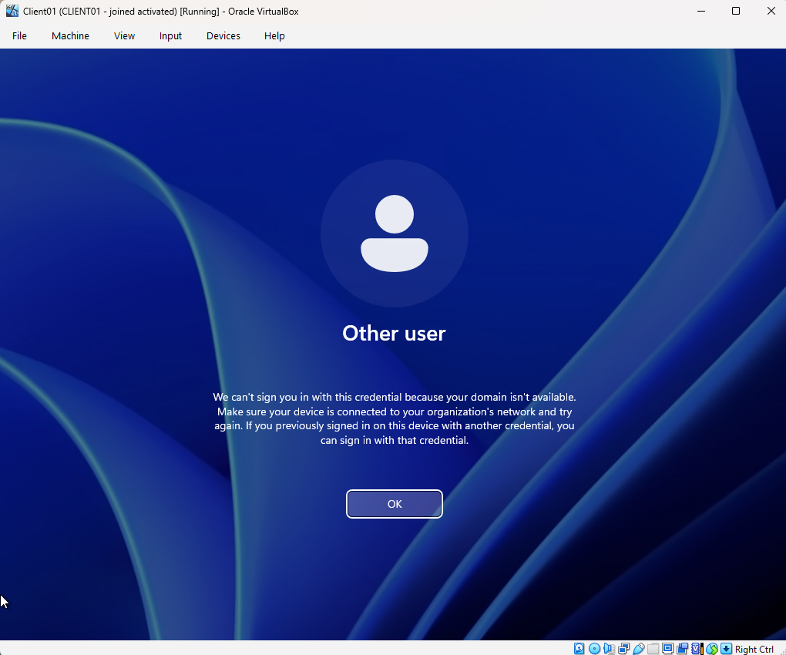
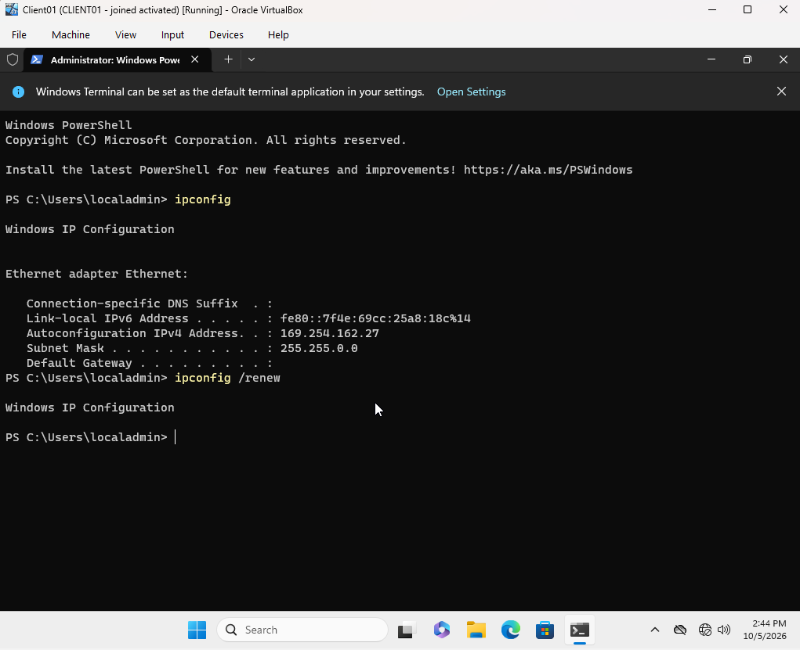
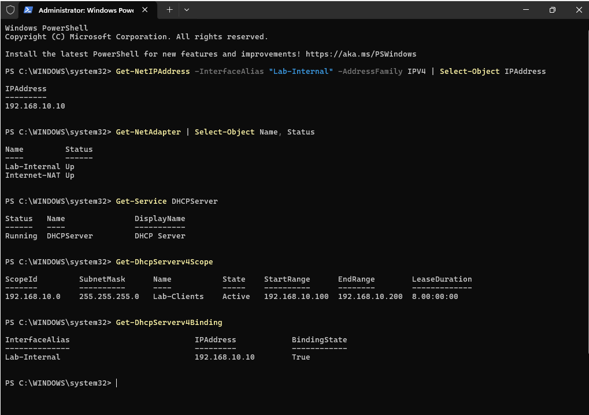
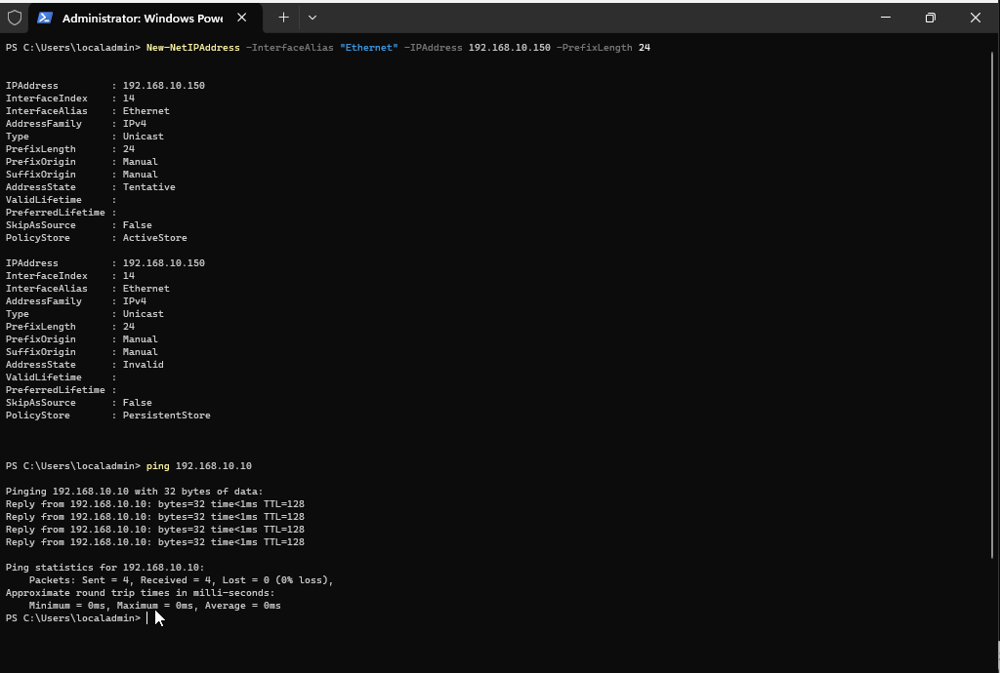
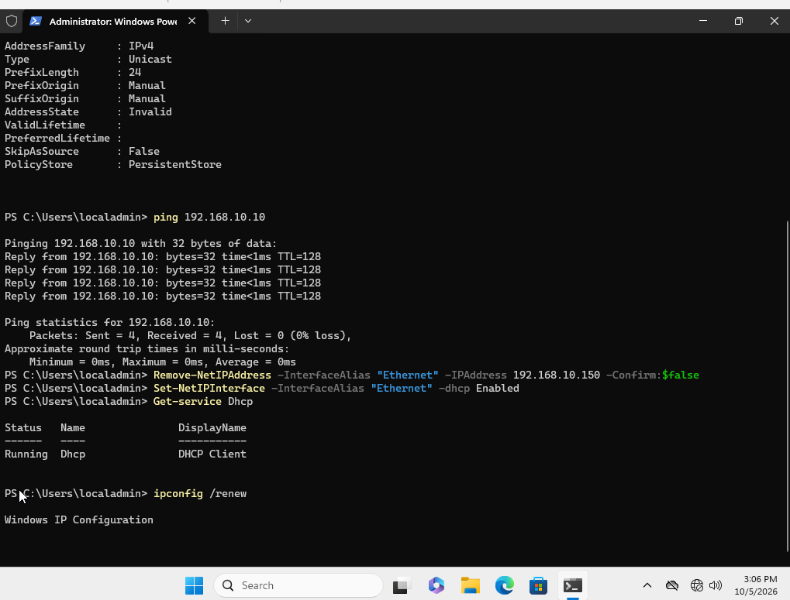
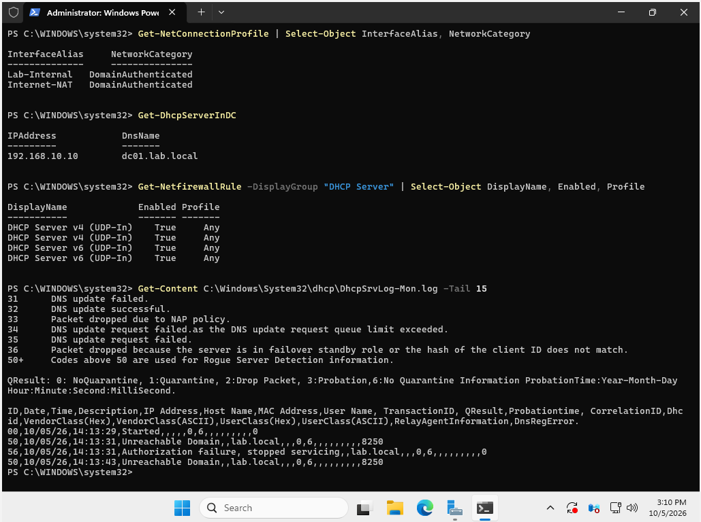
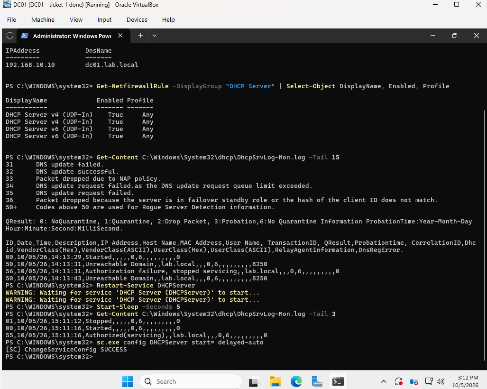
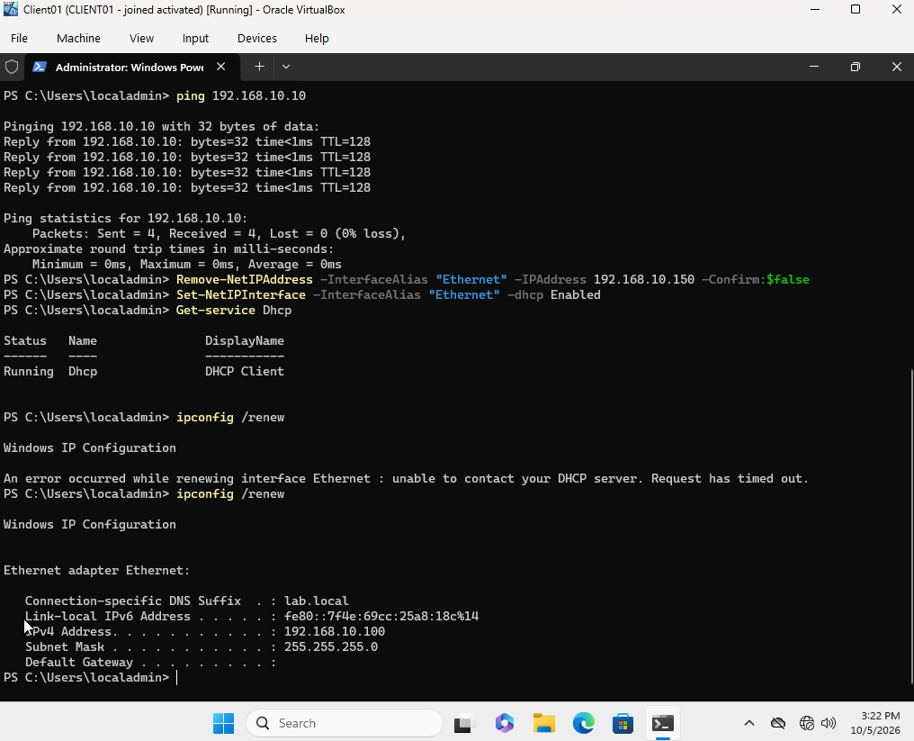

# Ticket 4: "Your Domain Isn't Available" (DHCP Outage)

[← Previous ticket](03-password-reset.md) | [Back to README](../README.md) | [Next ticket →](05-mapped-drive-access-denied.md)

| | |
|---|---|
| **Reported by** | Ana Lopez, HR (during [Ticket 3](03-password-reset.md)) |
| **Symptom** | "We can't sign you in with this credential because your domain isn't available." |
| **Root cause** | DHCP started 2 seconds after boot, before Active Directory was ready, failed its authorization check, and stopped serving addresses while still showing "Running" |
| **Resolution** | Restarted the DHCP service, then set it to delayed start |

This was the hardest ticket in the lab, because every quick check said things were fine.

## Symptom

Ana had never signed in on CLIENT01, so Windows had no cached copy of her credentials and had to reach DC01 directly. It couldn't.



## Investigation

### 1. Check the client's IP address

I signed in with the local account `.\localadmin` (no domain needed) and ran `ipconfig`:



A **169.254.x.x** address means Windows couldn't reach any DHCP server and assigned itself an address. `ipconfig /renew` hung waiting for an answer.

### 2. Check both VMs' virtual network settings

Both adapters were on `lab-net` with the virtual cable connected. Not the cause.

### 3. Check DHCP on DC01

```powershell
Get-NetIPAddress -InterfaceAlias "Lab-Internal" -AddressFamily IPv4 | Select-Object IPAddress
Get-NetAdapter | Select-Object Name, Status
Get-Service DHCPServer
Get-DhcpServerv4Scope
Get-DhcpServerv4Binding
```

Everything looked healthy: correct IP, adapters up, service **Running**, scope **Active**, binding **True**.



### 4. Separate the network from DHCP

I gave CLIENT01 a temporary static IP and pinged DC01:

```powershell
New-NetIPAddress -InterfaceAlias "Ethernet" -IPAddress 192.168.10.150 -PrefixLength 24
ping 192.168.10.10
```

**0% loss.** The VMs could talk, so the network was fine and the problem was DHCP itself. Then I put the client back to automatic:

```powershell
Remove-NetIPAddress -InterfaceAlias "Ethernet" -IPAddress 192.168.10.150 -Confirm:$false
Set-NetIPInterface -InterfaceAlias "Ethernet" -Dhcp Enabled
```



The DHCP Client service on CLIENT01 was running, so the client was asking. DC01 wasn't answering.



### 5. Read the DHCP audit log

```powershell
Get-NetConnectionProfile | Select-Object InterfaceAlias, NetworkCategory
Get-DhcpServerInDC
Get-NetFirewallRule -DisplayGroup "DHCP Server" | Select-Object DisplayName, Enabled, Profile
Get-Content C:\Windows\System32\dhcp\DhcpSrvLog-Mon.log -Tail 15
```

Network profile **DomainAuthenticated**, DHCP **authorized** in AD, firewall rules **enabled**. The log showed the real problem:

```
14:13:29  Started
14:13:31  Unreachable Domain
14:13:31  Authorization failure, stopped servicing
14:13:43  Unreachable Domain
```



## Root Cause

DHCP started **2 seconds** after DC01 booted, before Active Directory finished loading. It couldn't confirm its authorization in AD, so it **stopped serving** addresses. The service still showed "Running," which is why every status check looked fine.

## Resolution

```powershell
# Restart DHCP now that AD is up
Restart-Service DHCPServer
Get-Content C:\Windows\System32\dhcp\DhcpSrvLog-Mon.log -Tail 3

# Prevent it on future boots: start DHCP a couple of minutes after boot
sc.exe config DHCPServer start= delayed-auto
```

The log showed **Authorized(servicing)**, and `sc.exe` returned SUCCESS.



## Verification

CLIENT01 got `192.168.10.100` back right away, and Ana could sign in.



## Lessons

- A service showing "Running" doesn't mean it's working. Logs tell you what it's actually doing.
- The static IP test split one big question ("why can't the client reach the domain?") into two smaller ones, and ruled out the network in a minute.
