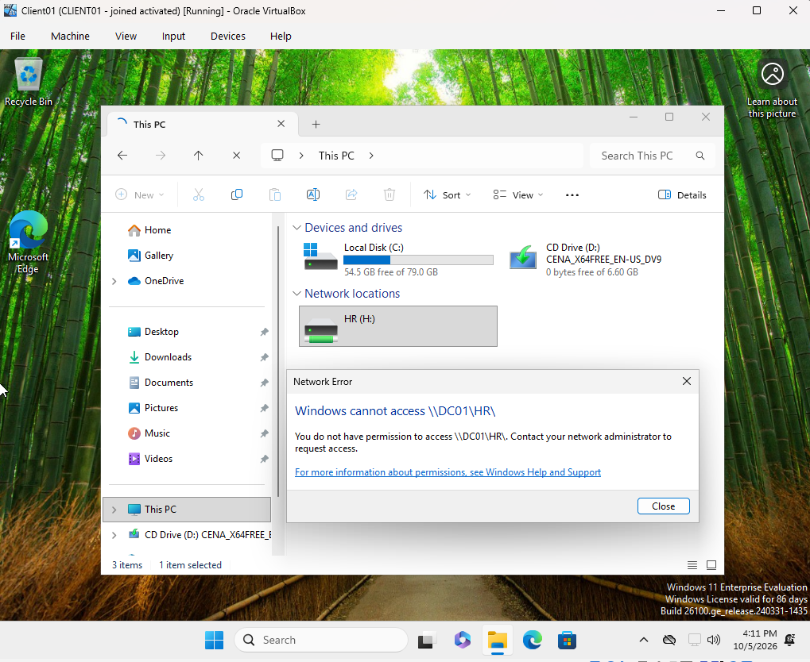
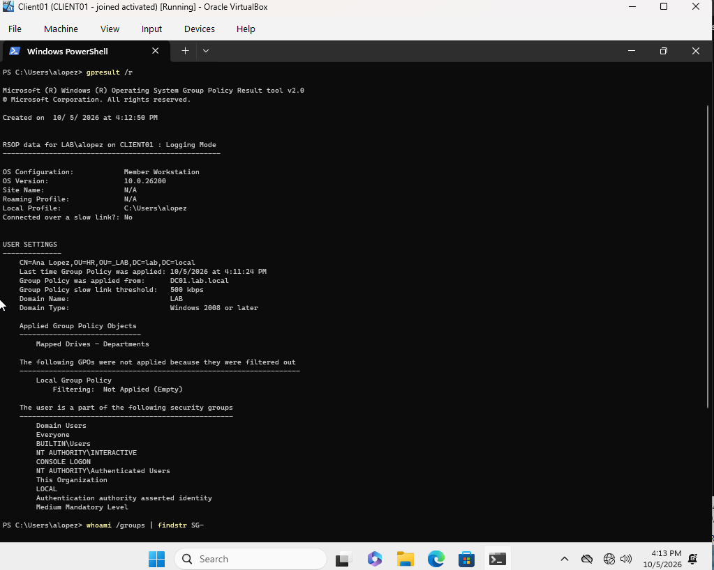
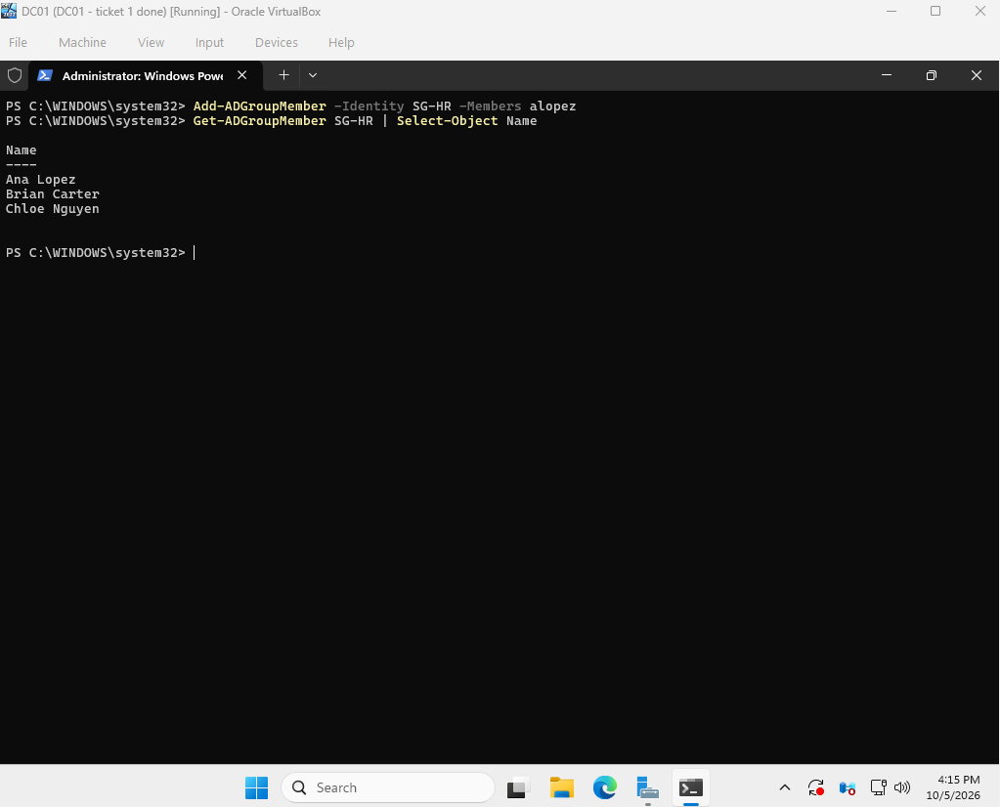
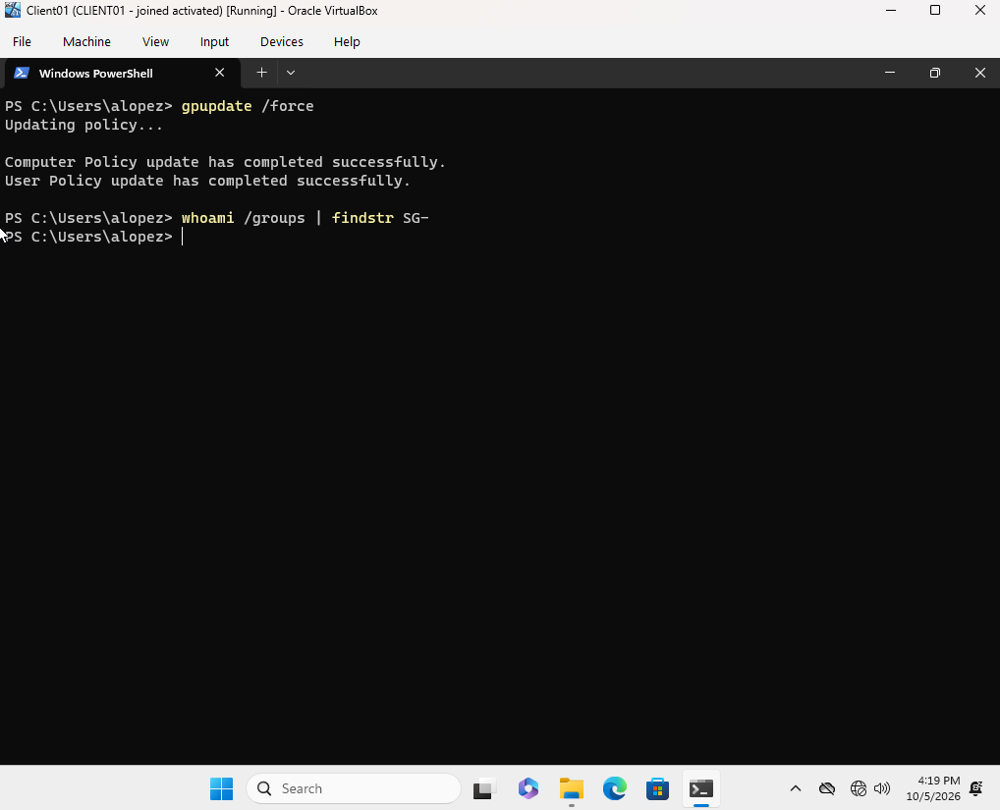
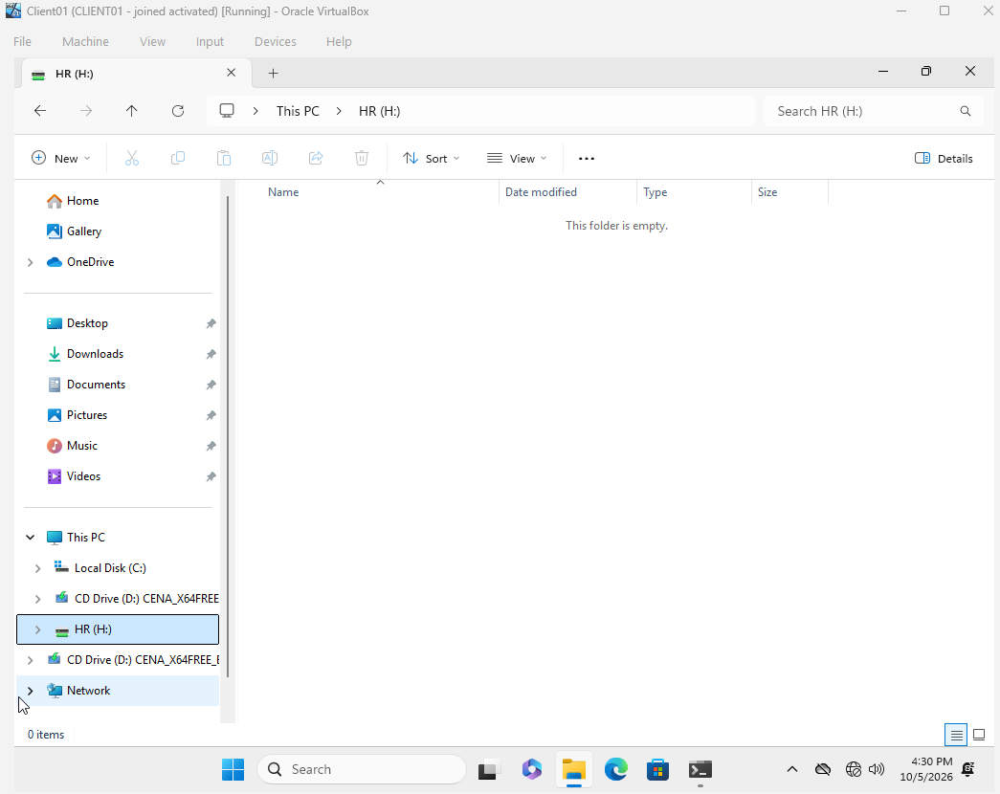
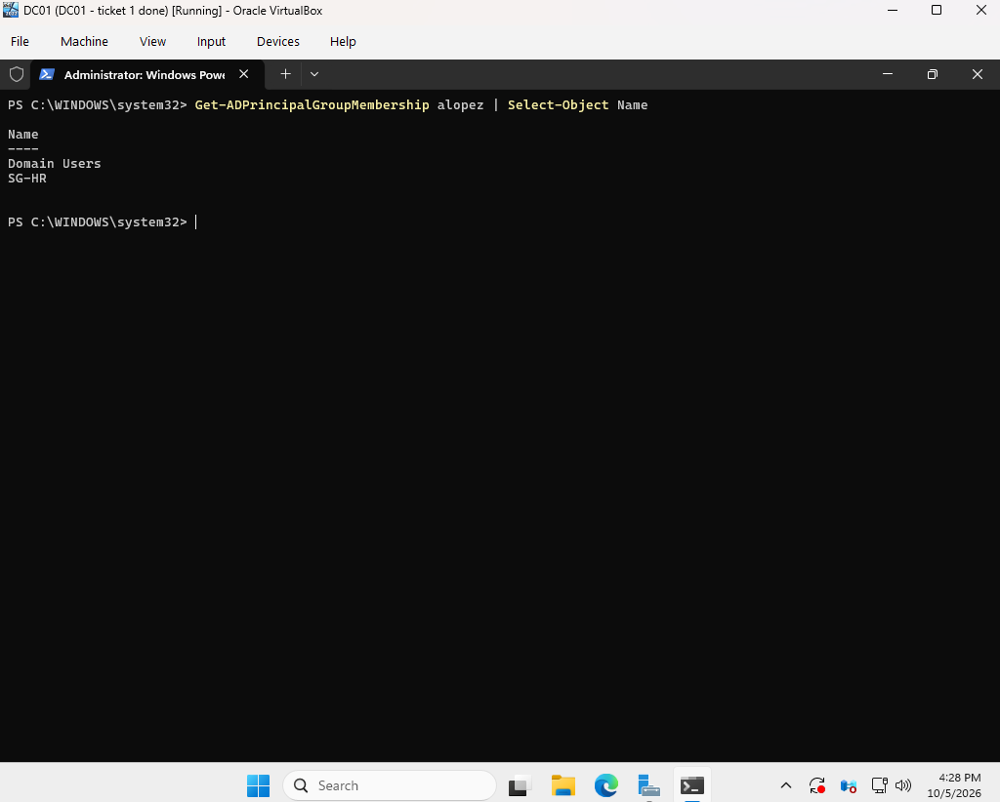

# Ticket 5: Mapped Drive Access Denied

[← Previous ticket](04-dhcp-outage.md) | [Back to README](../README.md) | [Next ticket →](06-trust-relationship-failed.md)

| | |
|---|---|
| **Reported by** | Ana Lopez, HR |
| **Symptom** | "My H: drive won't open. It says I don't have permission." |
| **Root cause** | Ana was removed from SG-HR during a group cleanup |
| **Resolution** | Re-added her to SG-HR, then she signed out and back in |

To set up this ticket, I removed Ana from SG-HR on DC01, playing the role of a coworker making a cleanup mistake:

```powershell
Remove-ADGroupMember -Identity SG-HR -Members alopez -Confirm:$false
```

## Symptom

After Ana signed back in, H: was **still listed**, but opening it failed.



**Why the drive stayed listed:** the drive map uses the **Update** action with **Reconnect** checked. When Ana stopped matching the SG-HR targeting, Group Policy stopped managing the drive but didn't remove it, so Windows kept reconnecting it. The permission check on the share happens live, so access was denied. The NTFS lockdown did its job.

## Investigation

`gpresult /r` showed the **Mapped Drives - Departments** GPO still applied to Ana, so the policy itself wasn't broken.



Checking her membership in Active Directory showed she was no longer in SG-HR.

## Resolution

```powershell
Add-ADGroupMember -Identity SG-HR -Members alopez
Get-ADGroupMember SG-HR | Select-Object Name
```



On CLIENT01, I ran `gpupdate /force`. The fix that restored access was signing Ana **out and back in**, since Windows builds a user's group membership at sign-in.



## Verification

H: opened normally.



In Active Directory, Ana is back in Domain Users and SG-HR:

```powershell
Get-ADPrincipalGroupMembership alopez | Select-Object Name
```



## Prevention

- Review group changes before removing members.
- Turn on **"Remove this item when it is no longer applied"** in each drive map's Common tab, so a drive disappears cleanly when someone leaves the group instead of lingering as a broken link.

## Open Question

On CLIENT01, `whoami /groups` and the group list in `gpresult /r` didn't show Ana's domain groups at all, before or after the fix, even while she had access to H:. I haven't explained that yet, so I relied on Active Directory and the actual access test as evidence instead.
