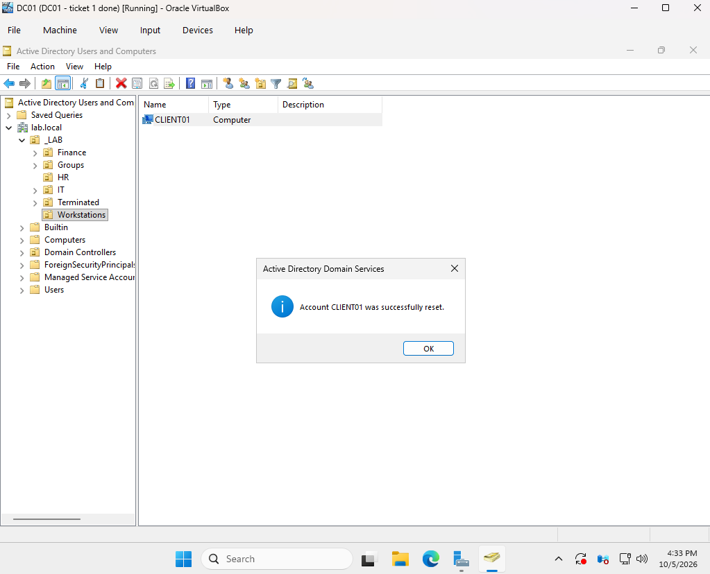
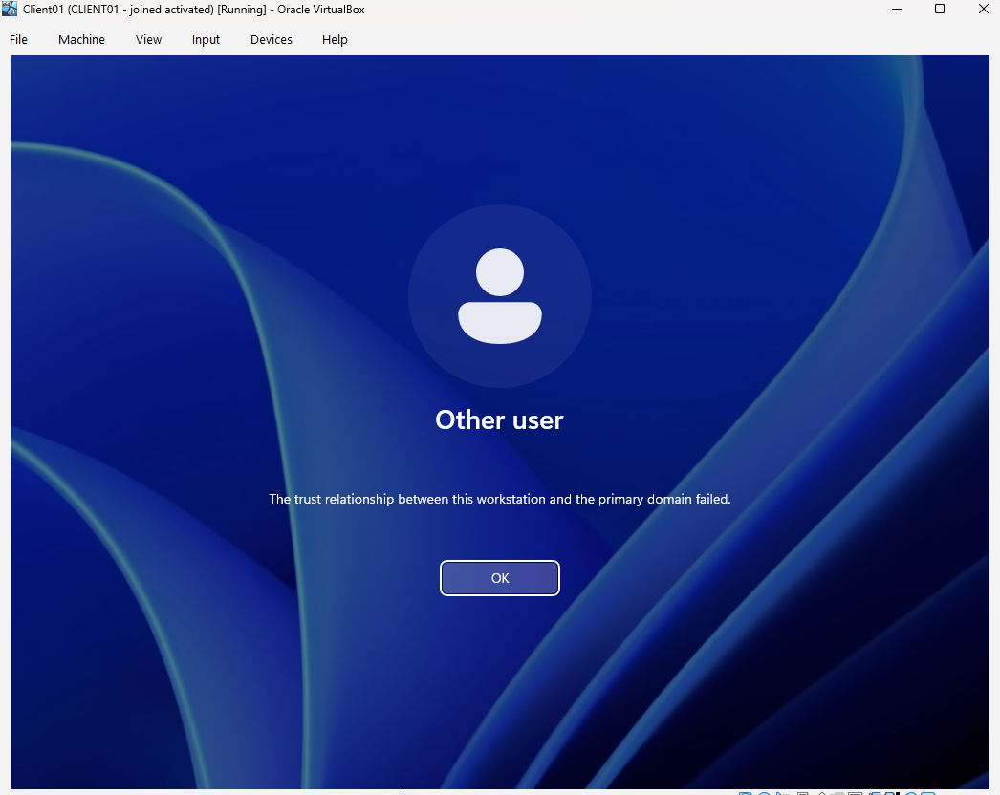
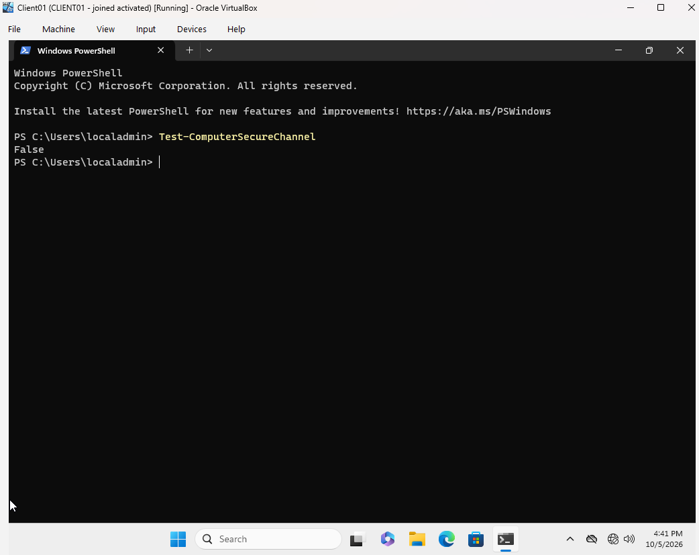
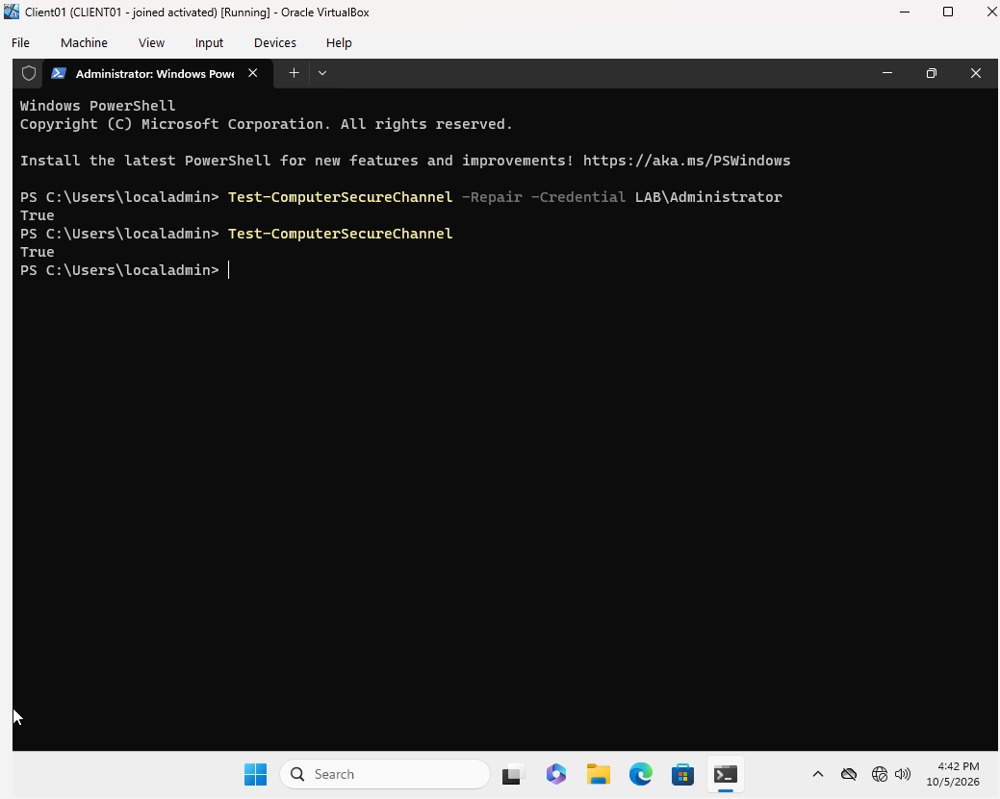
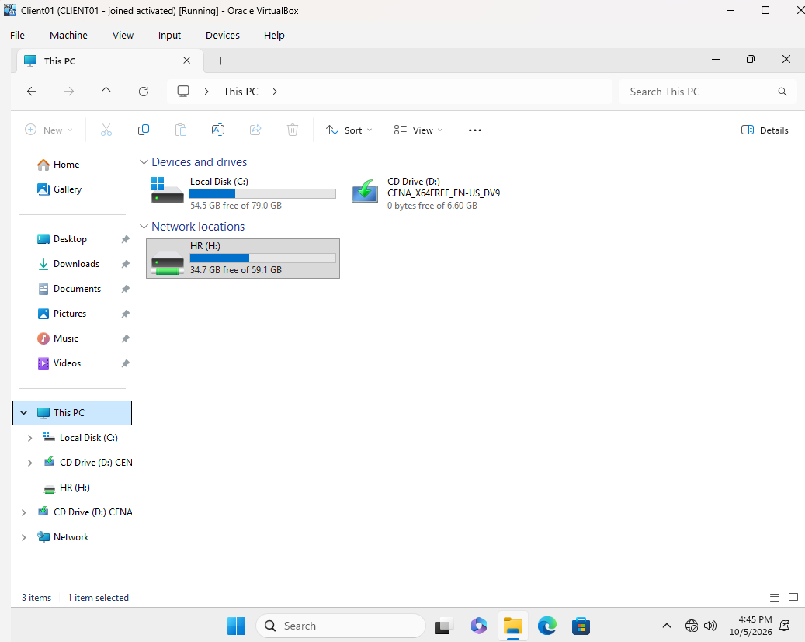

# Ticket 6: Trust Relationship Failed

[← Previous ticket](05-mapped-drive-access-denied.md) | [Back to README](../README.md) | [Next ticket →](07-offboarding.md)

| | |
|---|---|
| **Reported by** | Brian Carter, HR (first sign-in on CLIENT01) |
| **Symptom** | "The trust relationship between this workstation and the primary domain failed." |
| **Root cause** | CLIENT01's computer account password no longer matched Active Directory |
| **Resolution** | Repaired the secure channel with PowerShell, with no rejoin or reboot |

## Background

Every domain-joined computer has its own **computer account password**, shared with the domain controller and changed automatically about every 30 days. If the computer's copy and AD's copy stop matching, the domain stops trusting the computer. In real offices this often follows **restoring a PC from an old backup or snapshot**, or a PC being offline for a long time.

To cause it, I reset CLIENT01's computer account in ADUC:



## Symptom

After restarting CLIENT01, **Ana could still sign in**, using cached credentials from her earlier sessions. A broken trust can hide behind cached logins.

Brian had never signed in on CLIENT01, so there was nothing cached, and he got the error:



## Investigation

Domain logins were blocked, but local accounts don't need the domain. I signed in as `.\localadmin`:

```powershell
Test-ComputerSecureChannel
```

Result: **False**.



## Resolution

The traditional fix is to leave the domain, reboot, rejoin, and reboot again. PowerShell repairs the trust in place instead, from an **elevated** terminal:

```powershell
Test-ComputerSecureChannel -Repair -Credential LAB\Administrator
Test-ComputerSecureChannel
```

Both returned **True**.



## Verification

Brian signed in for the first time, set his password, and got his HR (H:) drive. A first-time sign-in only works when the computer and domain trust each other.


