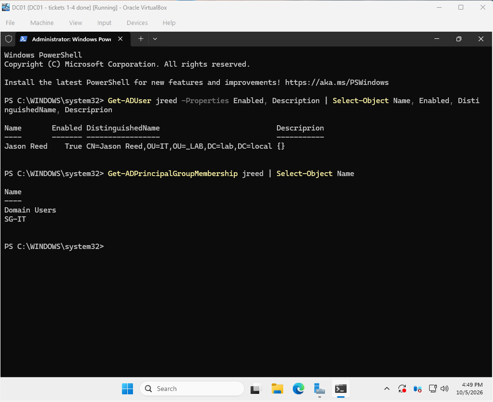
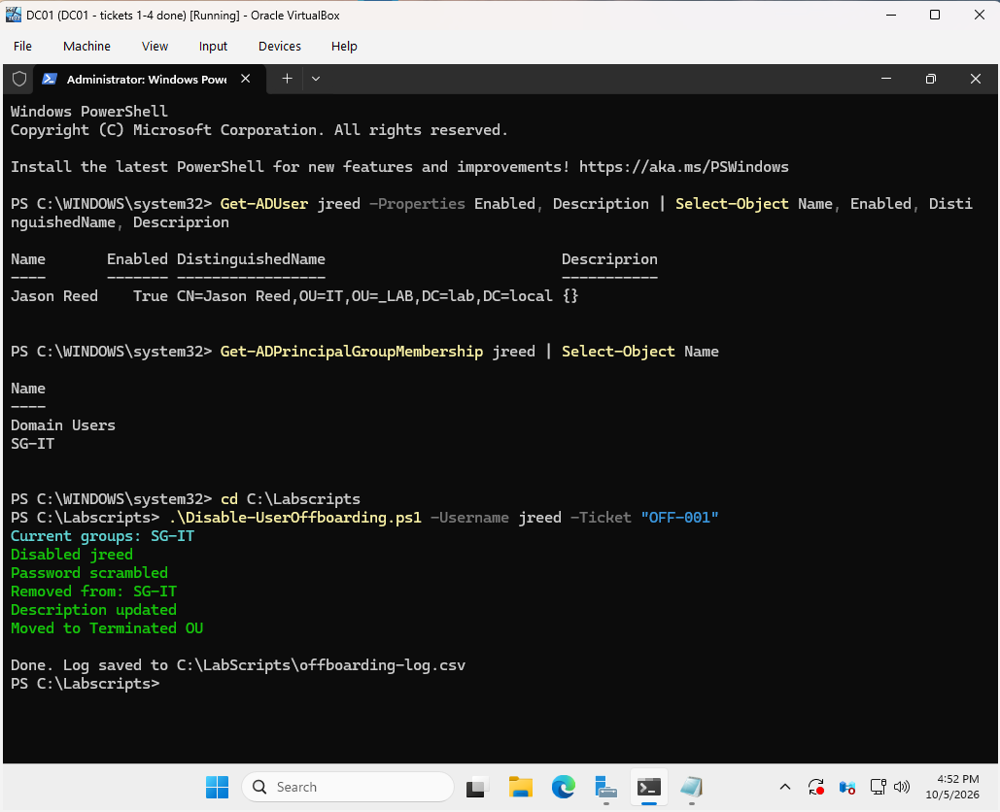
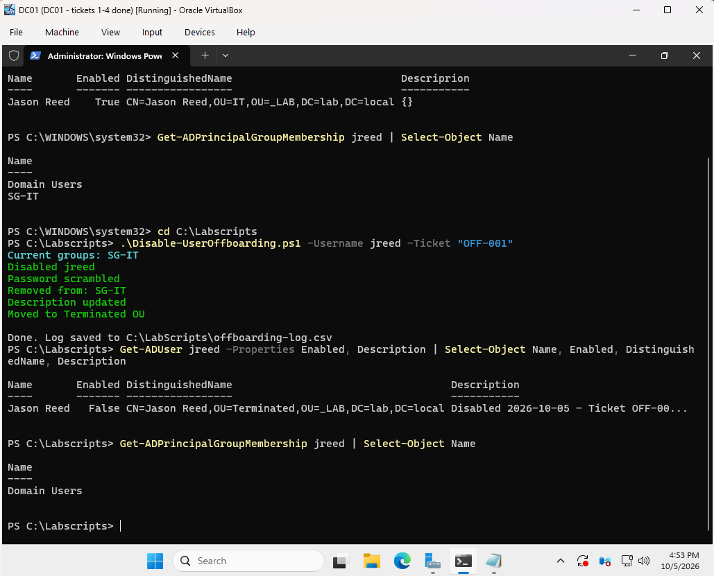
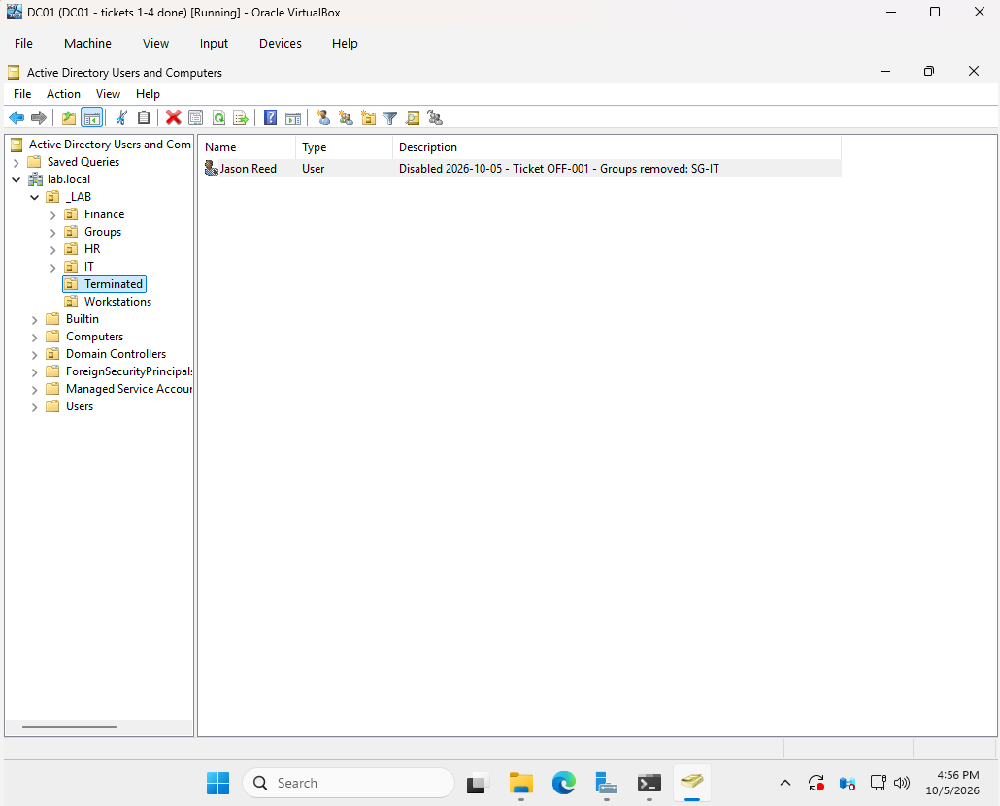

# Ticket 7: Offboard a Departing Employee

[← Previous ticket](06-trust-relationship-failed.md) | [Back to README](../README.md)

| | |
|---|---|
| **Ticket** | OFF-001 |
| **Request** | HR: "Jason Reed (IT, Network Technician) leaves today. Please disable his access." |
| **Resolution** | Ran the offboarding script and verified every step |

An account that stays active after someone leaves is a security risk. Offboarding takes more than clicking "Disable," so I built a script that follows a checklist.

## Before

```powershell
Get-ADUser jreed -Properties Enabled, Description | Select-Object Name, Enabled, DistinguishedName, Description
Get-ADPrincipalGroupMembership jreed | Select-Object Name
```

Jason was enabled, in the IT OU, and a member of Domain Users and SG-IT.



## The Script

[`Disable-UserOffboarding.ps1`](../scripts/Disable-UserOffboarding.ps1):

1. **Records** group memberships before changing anything, for audits or a rehire
2. **Disables** the account
3. **Scrambles** the password with a random value, so the old password can't be reused if someone re-enables the account by mistake
4. **Removes** all groups except Domain Users (the primary group, which AD keeps separately)
5. **Stamps** the description with the date, ticket number, and removed groups
6. **Moves** the account to the Terminated OU
7. **Logs** the action to `offboarding-log.csv`

```powershell
.\Disable-UserOffboarding.ps1 -Username jreed -Ticket "OFF-001"
```



## Verification

| | Before | After |
|---|---|---|
| Enabled | True | False |
| OU | IT | Terminated |
| Description | (empty) | Disabled 2026-10-05 - Ticket OFF-001 - Groups removed: SG-IT |
| Groups | Domain Users, SG-IT | Domain Users |



In ADUC, Jason sits in the Terminated OU with the disabled icon, and the description tells the next admin what happened and why.



## Why Disable Instead of Delete

Disabling keeps the account's SID, file ownership, and audit history intact. The account can be deleted later, per the company's retention policy.
